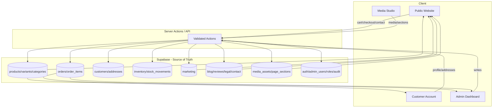
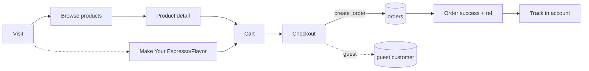
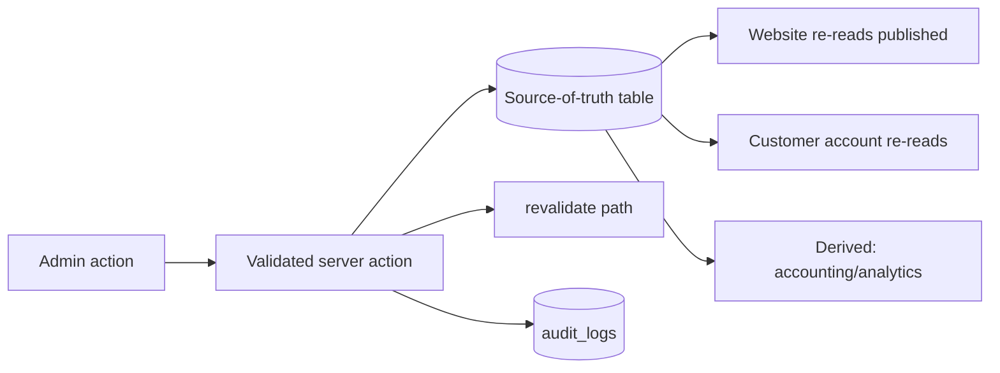
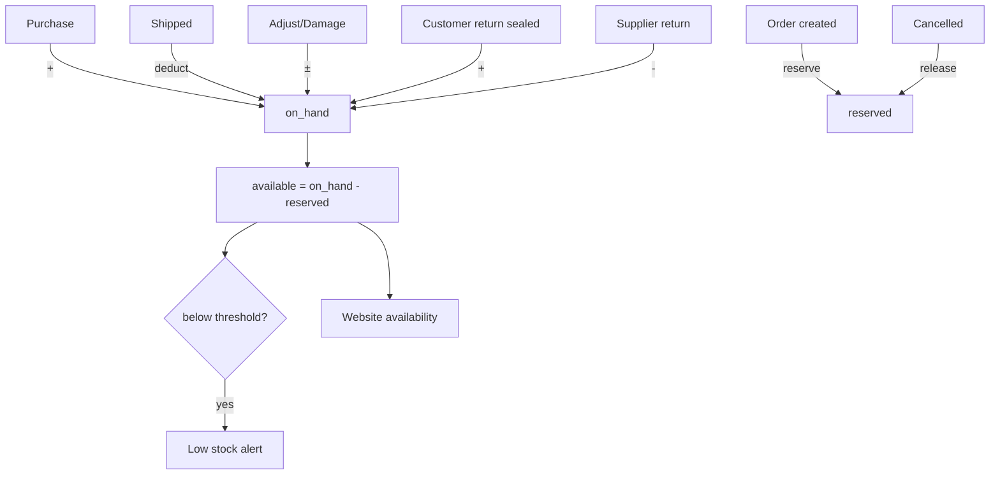
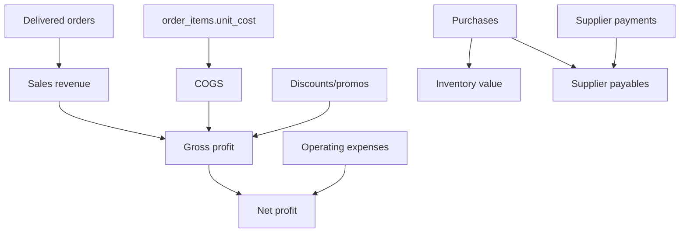
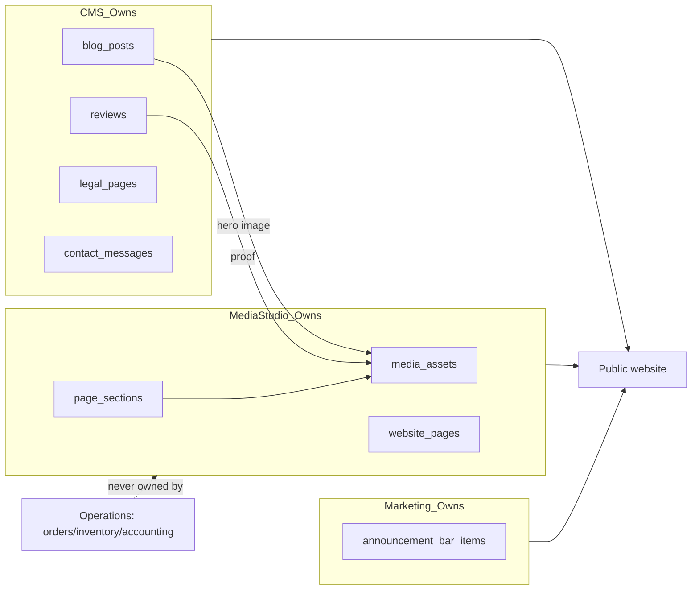
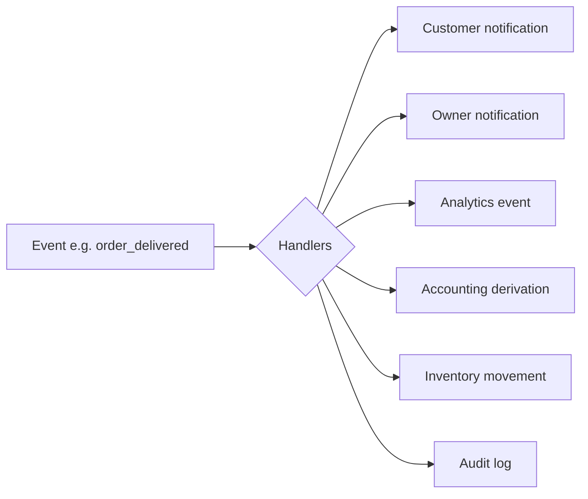

# LINE COFFEE V3 — BUSINESS + TECHNICAL OPERATING MODEL BLUEPRINT

> ⚠️ **STATUS: DEEP REFERENCE ONLY — NEVER AN EXECUTION PLAN.** (updated 2026-06-29)
> **Execution order/numbering is governed solely by `docs/ai/LINE_COFFEE_V3_MASTER_EXECUTION_PLAN.md`.** Any "Phase N" labels in this document belong to a superseded scheme — ignore them for execution.
> ⚠️ **(2026-06-28) DEEP REFERENCE — PARTIALLY SUPERSEDED (details below).**
> This document is a thorough model/ownership reference and is still useful for that. **But:**
> 1. Its **"current reality" columns are outdated (pre-2026-06-27).** Since it was written, checkout creates real orders, auth is real Supabase, and orders/customer-account are real — see `LINE_COFFEE_V3_CURRENT_STATE.md` for verified state.
> 2. It is **superseded for execution & phase order by `LINE_COFFEE_V3_MASTER_EXECUTION_PLAN.md` (it wins on any conflict)**, and for business-model details by `LINE_COFFEE_V3_FINAL_DECISIONS_AND_ROADMAP.md` (**decisions/history reference only**) — specifically: **Media Studio is CANCELLED** (replaced by `LINE_COFFEE_V3_CONTENT_MAP.md`); costing is **FIFO (lots)**; **Make Your Espresso is real raw-bean manufacturing**; **Make Your Flavor is cost-only**; delivery is **zone-based** (30/50/100 + governorate = courier, `delivery_fee = 0`); inventory is **deducted at *delivered*** (not shipped); **packaging deducts at Place Order**.
> When reading any section below: for **execution / phase order** follow the **MASTER_EXECUTION_PLAN**; for **business decisions** follow **FINAL_DECISIONS_AND_ROADMAP** (decisions/history only). This blueprint is **deep historical/reference only — never an execution plan.**

> The single source of truth for **how Line Coffee V3 should operate** as a real business and a
> real software system. This is not an audit, not implementation, not a flowchart. It defines the
> correct future model and the safe order to reach it.

---

## 0. Document Status

| Field | Value |
|---|---|
| **Purpose** | Define the complete future operating model (business + accounting + technical) for Line Coffee V3, and the safe phased path from today's mock UI to a real launch. |
| **Date** | 2026-06-24 |
| **Author role** | Senior system auditor + full-stack architect + product strategist + operations consultant + practical accounting advisor + UX/product thinker (merged). |
| **Input docs read** | `docs/ai/LINE_COFFEE_V3_CURRENT_STATE.md`; `AGENT_WORK_PROTOCOL.md`; `LINE_COFFEE_V3_PROJECT_LOG.md`; `docs/ai/LINE_COFFEE_V3_SYSTEM_AUDIT.md` (full A–R). |
| **Skills used** | `feature-flow-audit`, `frontend-code-audit`, `full-website-audit` — **already applied inside `LINE_COFFEE_V3_SYSTEM_AUDIT.md` (its Section Q)**. Their findings are reused here as evidence. They were **not re-run** for this document, to respect the no-broad-scan protocol and avoid duplicating completed work. |
| **Unavailable skills** | None. Graphify report (`graphify-out/GRAPH_REPORT.md`) does not exist; Graphify was not installed or run. |
| **Documentation-only?** | **Yes.** This is a planning/design document. |
| **Source code changed?** | **No.** No `src/`, components, styles, configs, build files, dependencies, database, or runtime code were touched. No public visuals changed. |
| **Relationship to the audit** | The audit answers *"what is wrong now."* This blueprint answers *"what is the correct system, who owns each domain, and in what order do we build it."* Audit findings appear only as evidence (the *Current Reality* columns), never as conclusions. |

### شرح مصري مبسط

ده المستند الرئيسي اللي بيقول **المشروع المفروض يشتغل إزّاي** كبيزنس حقيقي وكنظام حقيقي. مش أوديت تاني ومش هنكتب كود. الأوديت القديم قال "إيه الغلط دلوقتي"، والمستند ده بيقول "الصح المفروض يبقى شكله إيه، ومين مسؤول عن إيه، ونبنيه بأي ترتيب آمن". أنا **مغيّرتش أي كود ولا أي تصميم** — ده شرح وخطة بس. كل قسم مهم هتلاقي تحته "شرح مصري مبسط" عشان تفهمه من غير ما تكون مبرمج.

---

## 1. Executive Summary

**What Line Coffee V3 is today:** a visually premium, bilingual (EN/AR + RTL/LTR) **mock UI**.
The public website (28 routes) is complete and visually locked. ~13 admin modules exist in mock
form with realistic data shapes, drawers, and actions. Health score from the audit: **72/100**.

**The hard truth:** almost nothing is connected to a real source of truth. Buttons give visual
feedback but write to local component state that **resets on refresh**. The most damaging proof:

- **Checkout never creates an order.** The customer gets an `LC-XXXXXX` number and a success page,
  but Admin Orders, Customer Account Orders, and Accounting never see it.
- **The same domain is duplicated across disconnected mocks.** Orders live in **three** separate
  arrays (admin 17 / account 3 / accounting 8) that share no rows. Blog lives in two. Reviews,
  suppliers, and espresso beans each live in two.
- **Admin changes don't reach the website.** Product visibility, prices, categories, announcement
  bar, approved reviews, published blog posts — the website reads static files and ignores admin.
- **Auth is fake.** Login always signs in as "Mohamed Sayed" regardless of the email typed.
- **Four dead mock files** are imported by nobody.

**What it must become before launch:** a system where **every action flows through a validated
write to one source of truth per domain, and every other module reads from that source.** A
customer checkout must create a real order that the owner sees, the customer can track, inventory
deducts from, and accounting recognizes as revenue when delivered.

**Biggest operational risks (owner view):** (1) selling products that are out of stock because
inventory is decorative; (2) losing orders entirely because checkout writes nothing; (3) wrong
profit numbers because accounting uses a fake order set; (4) promising customers a discount field
that doesn't validate; (5) no real customer identity, so no real customer history or LTV.

**Biggest technical risks (architect view):** (1) building Supabase tables on top of **fragmented,
conflicting mock shapes** → schema rework and data loss; (2) starting backend before data contracts
exist → every module re-invents the same type differently; (3) mixing Media Studio into operational
modules → permanent ownership confusion; (4) wiring fake UI controls that imply backend behavior →
dishonest UX and customer trust damage.

**Safest path (one sentence):** *approve this model → safe dead-code cleanup → UI honesty pass →
unified TypeScript data contracts → centralize mock data to one source per domain → fix
auth/customer/order model → design Supabase schema → integrate core backend → make website read /
admin write the real source → derive inventory/accounting/analytics → build Media Studio → launch
hardening.* (Phases 0–13, Section 22.)

**What should happen immediately after this document is approved:** **Phase 1 — zero-risk dead-code
removal** (delete 4 orphan files) and **Phase 2 — UI honesty** (replace hardcoded account
addresses/notifications with honest empty states; add `// MOCK-ONLY` markers). No backend yet.

### شرح مصري مبسط

دلوقتي الموقع شكله جامد جدًا بس **مفيش حاجة حقيقية ورا الأزرار**. أهم مثال: العميل لما بيكمّل أوردر،
**الأوردر بيضيع** — لا بيوصل للداشبورد، لا بيظهر في حساب العميل، لا بيتحسب في الفلوس. كمان نفس الداتا
متكررة في أماكن كتير متوصلين ببعض (الأوردرات في 3 لستات مختلفة!). والمخزون مجرد أرقام على الشاشة
مش بتقلّل لما حد يشتري.

المطلوب نوصل لنظام: **أي فعل → يتسجّل في مكان واحد رسمي → باقي الموديولات تقرا منه**. يعني العميل
يطلب → الأوردر يتسجّل → إنت تشوفه → العميل يتابعه → المخزون ينقص → الفلوس تتحسب صح.

أخطر حاجات بزنسيًا: تبيع حاجة مش موجودة في المخزن، أو تخسر أوردرات، أو أرقام أرباح غلط. أخطر حاجة
تقنيًا: تبدأ تبني الداتا بيز قبل ما تظبط الشكل الموحّد للداتا. **أول خطوة بعد الموافقة:** تنضيف آمن
(حذف 4 ملفات ميتة) + تصليح الشاشات تبقى صادقة (تشيل الداتا المزيّفة في صفحات الحساب). من غير أي باك إند لسه.

---

## 2. The Three-Lens Operating Model

The same system, seen three ways, then merged.

### 2.1 Business Owner Lens

What Mohamed must be able to do and trust:

- **Real orders** — every customer order appears in the dashboard automatically, with status he controls.
- **Real customer history** — who bought what, how often, total spent, guest or registered, VIP signals.
- **Inventory visibility** — how many units of each size (250g/500g/1kg) and how many KG of beans exist; what's low; what's out.
- **Sales & profit visibility** — what was sold, what was *delivered* (real money), cost of those goods, and what's left as profit after expenses and purchases.
- **Low-stock alerts** — be told *before* running out, per size.
- **Supplier & purchase control** — what was bought, what's paid, what's still owed (including advances/credit).
- **Marketing & promo control** — create offers/promo codes that actually apply at checkout, and an announcement bar that actually shows on the site.
- **Website content control** — edit hero, banners, sections, blog, reviews — through the right tool (Media Studio / CMS), not by editing code.
- **Customer communication** — reply to contact messages and order updates (WhatsApp first).
- **Launch-safe operations** — nothing pretends to work; what's not ready is clearly marked.

### 2.2 Accountant / Operations Lens

What the money/operations layer needs (practical, launch-stage — not a full ERP):

- **Delivered orders = revenue.** Pending/confirmed orders are *expected* money, not recognized revenue.
- **Order-item cost snapshots.** Each order line stores the product cost *at the time of sale* so profit is historically correct even if costs change later.
- **COGS** = sum of those cost snapshots for delivered orders.
- **Gross profit** = delivered revenue − COGS − discounts on those orders (delivery fee is pass-through, not product profit).
- **Operating expenses** (rent, salaries, marketing spend, utilities) reduce **net profit**, separate from purchases.
- **Purchases** (buying beans/packaging/stock) are **not** operating expenses; they create inventory value and supplier payables.
- **Supplier balances** = unpaid purchases − payments (+ track advances/credit when overpaid).
- **Inventory movement** is the truth for stock: reserve → deduct → restock → adjust → return.
- **Revenue recognition rules** and **profit logic** must be derived from real `orders`/`purchases`/`expenses`, never hand-entered into a separate sheet.
- **Launch-critical:** revenue, COGS, gross profit, expenses, purchases, supplier payables, basic P&L. **Future ERP:** journal entries, double-entry ledgers, tax modules, depreciation.

### 2.3 Developer / System Architect Lens

What the engineer needs to build it right:

- **One source of truth per domain** (Supabase table), with a single writer category and well-defined readers.
- **Event-based flows:** an action triggers a validated server action → writes the source of truth → side effects (notifications, revalidation, audit log, derived reports).
- **Shared contracts:** unified TypeScript types in `src/lib/types/` that map 1:1 to tables, replacing fragmented mock shapes.
- **Server actions / API later:** typed signatures defined now (Section 18), implemented during backend phase.
- **Supabase tables later:** entity plan (Section 19) with relations and RLS.
- **RLS / security later:** customers read own rows; admins read all; promo validation server-only.
- **Revalidation / cache later:** `revalidatePath`/tags when admin writes affect public pages.
- **Module boundaries:** who writes vs who only reads; nothing writes another domain's table directly.
- **UI-only vs backend-required separation:** ship honest UI now; wire writes during backend phase.
- **Media Studio boundaries:** owns visual/page/media content only — never operational data.

### 2.4 Merged View Table

| Business Need | Owner Expectation | Accounting / Operations Meaning | Developer Translation | Current Reality | Fix Category | Priority |
|---|---|---|---|---|---|---|
| Customer places order | I see it instantly in the dashboard | Creates a pending order; expected revenue | `create_order` → `orders` + `order_items` (cost snapshot) | Checkout writes nothing | Backend/API/server action | P0 |
| Track order status | I move New→Delivered; customer sees it | Status drives revenue recognition + stock deduction | `update_order_status` + customer reads same `orders` | 3 separate order mocks; account shows fixed 3 | Backend/API + Mock cleanup | P0 |
| Real customers | Real names & history | Customer ledger, LTV, segments | Supabase Auth + `customers` linked by `user_id` | Login always "Mohamed Sayed" | Backend/API + Security | P0 |
| Product on/off website | Hide/show controls the site | Affects what's sellable | `products.status` + website published filter | Website reads static catalog, ignores status | Backend/API + Type contract | P0 |
| Inventory truth | Know stock per size; get alerts | Reserve/deduct/restock; inventory value | `inventory_items` + `stock_movements` derivation | Stock is local-only, decorative | Supabase/database | P1 |
| Profit truth | Trust the profit number | Delivered revenue − COGS − discounts − OpEx | Derive from `orders`/`purchases`/`expenses` | Accounting uses a separate 8-order mock | Backend/API + Mock cleanup | P1 |
| Promo codes work | Code applies a discount | Discount recorded against order | `validate_promo_code` (server-only) + checkout field | No promo field; codes never validated | Backend/API/server action | P1 |
| Announcement bar | I edit it; site shows it | n/a | `announcement_bar_items` + header reads active | Header hardcoded, ignores Marketing | Backend/API + Mock cleanup | P1 |
| Edit website visuals | Change images/sections safely | n/a | Media Studio → `page_sections` + `media_assets` | All hardcoded in `visual-content.ts` | Media Studio | P2 |
| Honest UI today | No fake buttons | n/a | Empty/disabled/sample states | Account pages show fake fixed data | UI/UX-only | now |

### شرح مصري مبسط

نفس النظام بنبصّله بـ3 عيون: **صاحب البيزنس** (عايز يتحكم ويشوف كل حاجة حقيقية)، **المحاسب**
(عايز فلوس وأرباح مظبوطة من الأوردرات الحقيقية)، و**المبرمج** (عايز كل داتا ليها مكان واحد رسمي
وقواعد واضحة مين يكتب ومين يقرا). الجدول اللي فوق بيجمع الـ3 مع بعض: كل احتياج بيزنس بنقول إنت
عايزه إزاي، يعني إيه محاسبيًا، المبرمج هيعمله إزاي، وهو دلوقتي شكله إيه، وأولويته.

---

## 3. Core Operating Principles

These are the non-negotiable rules of the future system:

1. **One source of truth per domain.** Each domain has exactly one table that owns its data. No domain lives in two arrays.
2. **Orders are operational truth.** Admin Orders, Customer Account, and Accounting all read the **same** `orders`/`order_items`. There is no "accounting orders" or "account orders" copy.
3. **Products/categories are not split across public/admin mocks.** One product source feeds website, admin, cart, and orders.
4. **Accounting & analytics are derived, never hand-kept.** They compute from real `orders`, `purchases`, `expenses`, and events — they don't store their own parallel transactions.
5. **Inventory is based on stock movements,** not scattered manual numbers. Current stock = derivable from the movement log; alerts come from thresholds per size.
6. **Website reads published/visible data only.** Drafts and hidden items never render publicly.
7. **Admin writes through controlled actions.** No admin screen mutates a website component directly; it writes a source of truth and the website re-reads.
8. **Customer actions write through controlled actions.** Checkout, signup, profile edits, contact form — all go through validated server actions.
9. **Media Studio controls visual/page/media content only.** Never products, prices, stock, orders, customers, accounting, promos, or order status.
10. **UI must never pretend backend behavior exists.** If there's no write, the control is disabled, labeled "sample," or shown as an honest empty state.
11. **Mock-only features are clearly marked or deferred.** Every save/submit with no server action carries a `// MOCK-ONLY` marker until wired.
12. **Public website visual design is locked.** Structure and styling don't change; only the *data source* behind them changes later.

### شرح مصري مبسط

دي القوانين اللي النظام كله هيمشي عليها: **كل نوع داتا ليه مكان واحد بس** (مش 3 لستات للأوردرات).
**الأوردر الحقيقي هو الأساس**، والداشبورد وحساب العميل والمحاسبة كلهم بيقروا من نفس المكان.
**المحاسبة بتتحسب لوحدها** من الأوردرات الحقيقية، مش بتتكتب بالإيد. **الموقع بيعرض بس الحاجة
المنشورة**. **الأدمن بيكتب بطريقة منظمة** والموقع يقرا. **الميديا ستديو للصور والمحتوى البصري بس**.
وأهم حاجة: **ممنوع زرار يوهم إنه شغّال وهو مش شغّال** — لو لسه مفيش باك إند، نقولها بصراحة.

---

## 4. Complete Source-of-Truth Domain Model

Future source of truth = the Supabase table that owns the domain. "Code" = stays in TypeScript
(contracts, seed/fallback, UI structure) and is not daily operational data.

| Domain | Business Meaning | Future Source of Truth | Writer(s) | Reader(s) | Current Source(s) | Current Problem | Required Fix Type | Launch Priority | Notes |
|---|---|---|---|---|---|---|---|---|---|
| Visitors / Sessions | Who's on the site | `analytics_events` (session rows) | System (client beacon) | Analytics | none | No tracking | Backend/API | P2 | Privacy-light; aggregate |
| Auth | Identity | Supabase Auth | Signup/Login | Header, Account, Admin | `useAuth` localStorage | Fake; fixed name | Backend/API + Security | P0 | JWT replaces localStorage |
| Customers | Customer ledger | `customers` | Signup, Checkout, Admin | Admin Customers, Account | `customers-mock.ts` (20) | Not linked to auth/orders | Backend/API | P0 | Guests are valid customers |
| Customer Addresses | Delivery addresses | `customer_addresses` | Customer, Checkout | Checkout, Account | `account-data.ts` (2 fixed) | Hardcoded, no CRUD | Backend/API | P1 | governorate/area/street |
| Products | Catalog | `products` | Admin Products | Website, Admin, Cart, Orders | `product-catalog.ts` (121) + `products-admin-mock.ts` | Two shapes, one domain | Type contract + Supabase | P0 | Merge to one |
| Product Variants | Size/price/SKU | `product_variants` | Admin Products | Website, Checkout, Orders | `catalogProducts[].sizes` | No stock_state | Supabase | P0 | 250g/500g/1kg |
| Categories | Grouping | `categories` | Admin Products | Website nav, Products, Admin | catalog + dead `categories.ts` + admin mock | 3 sources | Mock cleanup + Supabase | P0 | show_on_website |
| Product Images | Visuals | `media_assets` ↔ `products` | Media Studio (asset), Admin Products (link) | Website, Admin | string paths | No library | Media Studio | P1 | Studio owns asset, not price |
| Cart | Session basket | localStorage (session) | Customer | Checkout, Header | `useCart` localStorage | Fine as session cart | (none / optional) | P2 ok | DB cart optional post-launch |
| Wishlist | Saved items | localStorage **or** `wishlists` | Customer | Account, Header | `useWishlist` localStorage | No admin visibility | Backend/API | P2 | **Needs Decision** |
| Checkout | Order intake | (writes `orders`) | Customer | — | form + sessionStorage | Writes nothing real | Backend/API/server action | P0 | The critical gap |
| Orders | Order truth | `orders` | Checkout, Admin (status) | Admin, Account, Accounting | **3 mocks** (admin 17 / account 3 / accounting 8) | Domain split ×3 | Backend/API + Mock cleanup | P0 | Single table |
| Order Items | Order lines | `order_items` | Checkout (snapshot) | Admin, Accounting, Analytics | `AdminOrder.items` | No cost snapshot | Supabase | P0 | Snapshot price+cost |
| Order Status Timeline | History of status | `order_status_events` or `orders.status` + log | Admin, System | Admin, Account | `statusOverrides` local | Resets on refresh | Backend/API | P0 | Drives revenue/stock |
| Inventory Items | Stock per size | `inventory_items` | Admin Inventory, System | Admin, product availability | `inventory-mock.ts` FINISHED (121) | Decorative | Supabase | P1 | stock_250/500/1kg |
| Stock Reservations | Held stock for open orders | `stock_movements` (reserve rows) or `inventory.reserved` | System (checkout/confirm) | Inventory, availability | none | No reservation concept | Supabase | P1 | **Needs Decision** (when) |
| Stock Movements | Stock ledger | `stock_movements` | Admin Inventory, System | Inventory | `STOCK_MOVEMENTS` mock | Not from real orders | Supabase | P1 | Source of current qty |
| Espresso Beans | Bean catalog + stock | `espresso_beans` | Espresso Manager | Builder, Inventory, Manager | `espressoBeans.ts` (27) + `ESPRESSO_BEANS` (14) | **Two sources** | Mock cleanup + Supabase | P1 | Unify catalog+stock_kg |
| Flavor Items | Flavor catalog | `flavor_items` (+ `flavor_bases`) | Flavor Manager | Builder | `flavorData.ts` | Manager/builder separate | Type contract + Supabase | P1 | |
| Packaging Items | Bags/stickers/valves | `inventory_items` (type=packaging) | Admin Inventory | Inventory, Accounting | `PACKAGING_ITEMS` | unit-based | Supabase | P1 | unit-based per rules |
| Purchases | Buying stock | `purchases` | Accounting | Accounting, Inventory | `ACCOUNTING_PURCHASES` (3) | Doesn't touch inventory | Backend/API | P1 | Creates payable + stock |
| Suppliers | Supplier directory | `suppliers` | Inventory/Accounting | Inventory, Accounting, Purchases | `SUPPLIERS` + `ACCOUNTING_SUPPLIERS` | **Two sources** | Mock cleanup + Supabase | P1 | Unify |
| Supplier Payments | Payments to suppliers | `supplier_payments` | Accounting | Accounting | accounting mock | local-only | Backend/API | P1 | supports advance/credit |
| Operating Expenses | OpEx | `operating_expenses` | Accounting | Accounting | `ACCOUNTING_OPERATING_EXPENSES` (5) | local-only | Backend/API | P1 | Not purchases |
| Accounting Summaries | P&L / KPIs | **Derived** (views) | System | Accounting, Dashboard | computed from mock | From fake orders | Backend/API (derive) | P1 | Never hand-kept |
| Analytics Events | Behavior data | `analytics_events` | System | Analytics | `analytics-mock.ts` (static) | No real events | Backend/API | P2 | Derive KPIs |
| Promo Codes | Discount codes | `promo_codes` | Marketing | Checkout (validate, server-only) | `PROMO_CODES` (8) | Not validated at checkout | Backend/API + Security | P1 | server-only validate |
| Offers | Campaign offers | `offers` | Marketing | Checkout (future) | `OFFERS` (6) | Checkout unaware | Backend/API | P1/P2 | |
| Announcement Bar | Header messages | `announcement_bar_items` | Marketing | Public Header | hardcoded in `PublicHeader.tsx` + mock | Header ignores admin | Backend/API + Mock cleanup | P1 | Marketing owns content |
| Blog Posts | Journal | `blog_posts` | CMS | Public Blog, Journal section | `blog-data.ts` (10) + `cms-mock.ts` (6) | **Two sources** | Mock cleanup + Supabase | P1 | Reconcile shape |
| Reviews | Customer reviews | `reviews` | CMS, (customer submit) | Testimonials, Product pages | `visual-content.ts` (3) + `CMS_REVIEWS` (6) | **Two sources** | Mock cleanup + Supabase | P1 | approved+featured to site |
| Contact Messages | Inbound messages | `contact_messages` | Contact Form | CMS inbox | `CMS_CONTACT_MESSAGES` (5) | Form writes nothing | Backend/API/server action | P1 | |
| Legal Pages | Privacy/Terms/etc | `legal_pages` | CMS | Public legal routes | hardcoded routes + CMS mock | Edits don't publish | Backend/API | P2 | |
| Media Assets | Image/video library | `media_assets` | Media Studio | Website, Admin, CMS | hardcoded paths | No library | Media Studio | P1 (contract) / P2 (build) | alt EN/AR, variants |
| Website Pages | Page registry | `website_pages` | Media Studio | Website | implicit routes | none | Media Studio | P2 | page_key |
| Page Sections | Editable blocks | `page_sections` | Media Studio | Website sections | `visual-content.ts` | hardcoded | Media Studio | P2 | configurable vs locked |
| Site Settings | Phone/email/social/policies | `site_settings` | Admin Settings | Website, Checkout | scattered constants | scattered | Backend/API | P1 | e.g. delivery thresholds |
| SEO Metadata | Titles/OG/schema | `generateMetadata` + (later) per-page fields | Code / CMS | Website `<head>` | mostly missing | No metadata | SEO/performance | P1 | |
| Notifications | Customer + admin alerts | `notifications` | System | Account, Admin | `account-data.ts` (3 fixed) | Never triggered | Backend/API | P2 | Event-driven |
| Admin Users | Admin accounts | `admin_users` | Supabase Auth | Admin Shell | localStorage auto-seed | Anyone can enter admin | Security/permissions | P0 | role field |
| Roles / Permissions | Access control | `roles` / claims | Owner | All admin | none | No authorization | Security/permissions | P0/P1 | RLS-backed |
| Audit Logs | Admin action history | `audit_logs` | System (triggers) | Admin | none | none | Backend/API | P2 | actor/action/before/after |

### شرح مصري مبسط

الجدول ده أهم حاجة في المستند: لكل نوع داتا (أوردرات، عملاء، منتجات، مخزون، فلوس، صور...) بنقول
**فين المفروض تتخزن في المستقبل، مين يكتبها، مين يقراها، وهي دلوقتي فين والمشكلة فيها**. أكتر
مشاكل خطيرة: الأوردرات في 3 أماكن، والمنتجات في شكلين، والريفيوهات والموردين وحبوب الإسبريسو كل
واحد في مكانين. لازم نوحّدهم قبل الداتا بيز.

---

## 5. Complete Event-Based Operating Model

The heart of the system. Every meaningful action is an **event** that triggers a validated write
and defined side effects. Columns are abbreviated for width; legend below.

**Legend:** **Acct** = accounting impact · **Inv** = inventory impact · **Notif** = notification ·
**Analytics** = analytics impact · **BE** = backend/API need · **DB** = database need · **MS** =
Media Studio need · **P** = priority. ✓ = yes/needed · — = none · ◑ = partial/optional.

| Event | Trigger | Business Meaning | Data Created/Updated | Modules Affected | Notif | Acct | Inv | Analytics | UI/UX | BE | DB | MS | P |
|---|---|---|---|---|---|---|---|---|---|---|---|---|---|
| visitor_session_started | First page load | A visit begins | session row | Analytics | — | — | — | ✓ | — | ✓ | ✓ | — | P2 |
| page_viewed | Route render | Traffic | event row | Analytics | — | — | — | ✓ | — | ✓ | ✓ | — | P2 |
| product_viewed | Product page | Interest signal | event row | Analytics | — | — | — | ✓ | — | ✓ | ✓ | — | P2 |
| category_viewed | Category page | Interest | event row | Analytics | — | — | — | ✓ | — | ✓ | ✓ | — | P2 |
| search_performed | Search submit | Demand signal | event row | Analytics | — | — | — | ✓ | — | ✓ | ✓ | — | P2 |
| cart_item_added | Add to cart | Buying intent | cart (local) | Cart, Header | — | — | ◑ check avail | ✓ | ✓ | ◑ | — | — | P0(UI)/P2 |
| cart_item_removed | Remove | — | cart (local) | Cart | — | — | — | ✓ | ✓ | — | — | — | P2 |
| wishlist_item_added | Heart click | Saved interest | wishlist | Account, Header | — | — | — | ✓ | ✓ | ◑ | ◑ | — | P2 |
| wishlist_item_removed | Unheart | — | wishlist | Account | — | — | — | ◑ | ✓ | ◑ | ◑ | — | P2 |
| checkout_started | Checkout page | Funnel step | event | Analytics | — | — | — | ✓ | — | ✓ | ✓ | — | P1 |
| checkout_submitted | Place order | **Order intake** | → order_created | Checkout | — | — | — | ✓ | ✓ | ✓ | ✓ | — | P0 |
| **order_created** | Checkout submit | New pending order | `orders`+`order_items` (cost snapshot) | Admin Orders, Account, Accounting, Inventory | ✓ owner+customer | ✓ pending (expected) | ◑ reserve (decision) | ✓ | ✓ | ✓ | ✓ | — | **P0** |
| order_confirmed | Owner confirms | Accepted | `orders.status` | Admin, Account | ✓ customer | ◑ | ✓ reserve | ✓ | ✓ | ✓ | ✓ | — | P0 |
| order_preparing | Owner sets | Being prepared | status | Admin, Account | ✓ | — | — | ✓ | ✓ | ✓ | ✓ | — | P0 |
| order_shipped | Owner sets | Out for delivery | status | Admin, Account | ✓ | — | ◑ deduct (decision) | ✓ | ✓ | ✓ | ✓ | — | P0 |
| **order_delivered** | Owner sets | **Revenue earned** | status | Admin, Account, Accounting | ✓ | ✓ recognize revenue+COGS | ✓ deduct | ✓ | ✓ | ✓ | ✓ | — | **P0** |
| order_cancelled | Owner/customer | Voided | status | Admin, Account, Accounting | ✓ | ✓ reverse expected | ✓ release | ✓ | ✓ | ✓ | ✓ | — | P0 |
| order_returned | Owner sets | Refund/return | status + return rows | Admin, Account, Inventory | ✓ | ✓ reverse revenue | ✓ restock if sealed | ✓ | ✓ | ✓ | ✓ | — | P1 |
| payment_status_changed | Owner marks paid | Cash collected | `orders.payment_status` | Admin, Accounting | ◑ | ✓ cash in | — | ◑ | ✓ | ✓ | ✓ | — | P1 |
| stock_reserved | Order created/confirmed | Hold stock | `stock_movements` | Inventory | — | — | ✓ | — | ◑ | ✓ | ✓ | — | P1 |
| stock_released | Cancel/expire | Free stock | `stock_movements` | Inventory | — | — | ✓ | — | ◑ | ✓ | ✓ | — | P1 |
| stock_deducted | Ship/deliver | Stock leaves | `stock_movements` | Inventory | ◑ low check | ✓ COGS basis | ✓ | ◑ | — | ✓ | ✓ | — | P1 |
| stock_adjusted | Manual adjust | Correction/damage/loss | `stock_movements` | Inventory | ◑ | ◑ value change | ✓ | — | ✓ | ✓ | ✓ | — | P1 |
| low_stock_detected | qty < threshold | Reorder signal | (derived) | Inventory, Dashboard | ✓ owner | — | ✓ | ◑ | ✓ | ✓ | ✓ | — | P1 |
| purchase_created | Add purchase | Bought stock | `purchases` + `stock_movements` | Accounting, Inventory | — | ✓ payable + inventory value | ✓ increase | — | ✓ | ✓ | ✓ | — | P1 |
| purchase_paid | Pay supplier | Cash out | `supplier_payments` | Accounting | — | ✓ reduce payable | — | — | ✓ | ✓ | ✓ | — | P1 |
| supplier_created | Add supplier | Directory | `suppliers` | Inventory, Accounting | — | — | — | — | ✓ | ✓ | ✓ | — | P1 |
| supplier_payment_due | Balance unpaid | Owe money | (derived) | Accounting, Dashboard | ◑ | ✓ payable | — | — | ✓ | ✓ | ✓ | — | P2 |
| expense_recorded | Add expense | OpEx out | `operating_expenses` | Accounting | — | ✓ reduce net profit | — | — | ✓ | ✓ | ✓ | — | P1 |
| product_created | Add product | New catalog item | `products`+`product_variants` | Products, Website, Inventory | — | — | ◑ create stock row | ◑ | ✓ | ✓ | ✓ | ◑ image | P0 |
| product_updated | Edit product | Catalog change | `products` | Products, Website | — | — | — | — | ✓ | ✓ | ✓ | ◑ | P0 |
| product_archived | Archive | Remove from sale | `products.status` | Products, Website | — | — | — | — | ✓ | ✓ | ✓ | — | P0 |
| product_published | Publish | Show on site | `products.status` | Products, Website | — | — | — | — | ✓ | ✓ | ✓ | — | P0 |
| product_price_changed | Edit price | New price | `product_variants.price` | Products, Website, Cart | — | ◑ future margin | — | — | ✓ | ✓ | ✓ | — | P0 |
| category_created | Add category | New group | `categories` | Products, Website nav | — | — | — | — | ✓ | ✓ | ✓ | ◑ banner | P0 |
| category_hidden | Toggle show | Nav change | `categories.show_on_website` | Website nav | — | — | — | — | ✓ | ✓ | ✓ | — | P1 |
| promo_code_created | Marketing add | New code | `promo_codes` | Marketing | — | — | — | — | ✓ | ✓ | ✓ | — | P1 |
| promo_code_validated | Checkout apply | Discount accepted | (read) + order discount | Checkout, Marketing, Accounting | — | ✓ discount recorded | — | ✓ | ✓ | ✓ (server-only) | ✓ | — | P1 |
| promo_code_rejected | Checkout apply | Invalid/expired | (read) | Checkout | — | — | — | ✓ | ✓ | ✓ | ✓ | — | P1 |
| offer_activated | Marketing activate | Campaign live | `offers.status` | Marketing, Checkout | — | — | — | ◑ | ✓ | ✓ | ✓ | — | P2 |
| announcement_published | Marketing publish | Bar message live | `announcement_bar_items` | Public Header | — | — | — | — | ✓ | ✓ | ✓ | — | P1 |
| contact_message_submitted | Contact form | Inbound inquiry | `contact_messages` | CMS inbox | ✓ owner | — | — | ◑ | ✓ | ✓ | ✓ | — | P1 |
| contact_message_replied | CMS reply | Responded | `contact_messages.status` | CMS | ✓ customer (WA) | — | — | — | ✓ | ✓ | ✓ | — | P2 |
| review_submitted | Customer/CMS add | New review | `reviews` (pending) | CMS | ✓ owner | — | — | ◑ | ✓ | ✓ | ✓ | ◑ proof | P1 |
| review_approved | CMS approve | Goes public | `reviews.status` | Testimonials, Product | — | — | — | — | ✓ | ✓ | ✓ | — | P1 |
| review_rejected | CMS reject | Hidden | `reviews.status` | CMS | — | — | — | — | ✓ | ✓ | ✓ | — | P1 |
| blog_post_created | CMS create | Draft article | `blog_posts` (draft) | CMS | — | — | — | — | ✓ | ✓ | ✓ | ◑ hero | P1 |
| blog_post_published | CMS publish | Live article | `blog_posts.status` | Public Blog, Journal | — | — | — | ◑ | ✓ | ✓ | ✓ | ◑ | P1 |
| legal_page_updated | CMS edit | Policy change | `legal_pages` | Public legal | — | — | — | — | ✓ | ✓ | ✓ | — | P2 |
| media_asset_uploaded | Studio upload | New asset | `media_assets` + storage | Media Studio, all visuals | — | — | — | — | ✓ | ✓ | ✓ | ✓ | P2 |
| page_section_updated | Studio edit | Section draft | `page_sections` (draft) | Media Studio | — | — | — | — | ✓ | ✓ | ✓ | ✓ | P2 |
| page_section_published | Studio publish | Section live | `page_sections.status` | Website section | — | — | — | — | ✓ | ✓ | ✓ | ✓ | P2 |
| customer_signed_up | Signup | New account | Auth + `customers` | Account, Admin Customers | ✓ welcome | — | — | ✓ | ✓ | ✓ | ✓ | — | P0 |
| customer_logged_in | Login | Session | Auth session | Header, Account | — | — | — | ✓ | ✓ | ✓ | ✓ | — | P0 |
| guest_customer_created | Guest checkout | Guest ledger row | `customers` (guest) | Admin Customers, Orders | — | — | — | ✓ | ◑ | ✓ | ✓ | — | P0 (Needs Decision) |
| profile_updated | Edit profile | Account change | `customers` | Account, Admin | — | — | — | — | ✓ | ✓ | ✓ | ◑ avatar | P1 |
| address_created | Add address | Saved address | `customer_addresses` | Checkout, Account | — | — | — | — | ✓ | ✓ | ✓ | — | P1 |
| address_updated | Edit address | Changed | `customer_addresses` | Checkout, Account | — | — | — | — | ✓ | ✓ | ✓ | — | P1 |
| admin_user_created | Owner adds staff | New admin | `admin_users` | Admin Shell | ✓ | — | — | — | ✓ | ✓ | ✓ | — | P1 |
| role_permission_changed | Owner edits role | Access change | `roles` | All admin | — | — | — | — | ✓ | ✓ | ✓ | — | P1 |
| audit_log_recorded | Any admin write | Action history | `audit_logs` | Admin | — | — | — | — | — | ✓ | ✓ | — | P2 |

**Project-specific events beyond the example list (discovered from the project/audit):**

- `espresso_blend_added_to_cart` / `flavor_mix_added_to_cart` — custom builder items carry composition + total weight; orders must store the configuration snapshot.
- `inventory_customer_return_received` / `inventory_supplier_return_sent` — separate workflows per business rules (sealed→restock; opened/damaged→no restock).
- `supplier_overpaid` → creates **supplier credit/advance** (per existing accounting logic).
- `category_show_on_website_blocked` — toggling visibility on an archived/draft category is rejected (existing UI rule).

### شرح مصري مبسط

ده "خريطة الأحداث": كل فعل في النظام (العميل يضيف للسلة، يعمل أوردر، إنت تغير الحالة، تضيف مشترى،
تنشر مقال...) بنقول بيحصل بعده إيه بالظبط: إيه الداتا اللي بتتسجّل، مين بيتأثر، حد بياخد إشعار،
بيأثر على الفلوس ولا المخزون ولا التحليلات، ومحتاج باك إند/داتا بيز ولا لأ، وأولويته. الصفوف
المهمة جدًا: **order_created** (الأوردر يتسجّل) و **order_delivered** (هنا بس الفلوس تتحسب ربح).

---

## 6. "Who Hears Where" Impact Map

For each major event: who **changes (writes/updates)**, who **only reads**, who is **not involved**.
✍️ = writes/changes here · 👁️ = reads/reflects here · — = not involved.

| Event | Website | Customer Account | Admin Dashboard | Orders | Customers | Inventory | Accounting | Analytics | Marketing | CMS | Media Studio | Notifications | Audit Logs |
|---|---|---|---|---|---|---|---|---|---|---|---|---|---|
| order_created | 👁️ success | 👁️ new order | 👁️ new row | ✍️ | 👁️/✍️ guest | 👁️ avail | 👁️ expected | ✍️ | 👁️ promo use | — | — | ✍️ | ✍️ |
| order_delivered | — | 👁️ status | 👁️ status | ✍️ | 👁️ LTV↑ | ✍️ deduct | ✍️ revenue+COGS | ✍️ | 👁️ | — | — | ✍️ | ✍️ |
| order_cancelled | — | 👁️ | 👁️ | ✍️ | 👁️ | ✍️ release | ✍️ reverse | ✍️ | 👁️ | — | — | ✍️ | ✍️ |
| product_published | 👁️ appears | — | 👁️ | — | — | 👁️ | — | — | — | — | 👁️ image | — | ✍️ |
| product_price_changed | 👁️ price | — | ✍️ | (future orders) | — | — | 👁️ margin | — | — | — | — | — | ✍️ |
| promo_code_validated | 👁️ discount | — | — | ✍️ discount | — | — | ✍️ discount | ✍️ | 👁️ usage | — | — | — | ✍️ |
| announcement_published | 👁️ bar shows | — | — | — | — | — | — | — | ✍️ | — | — | — | ✍️ |
| review_approved | 👁️ testimonial | — | — | — | — | — | — | — | — | ✍️ | 👁️ proof | — | ✍️ |
| blog_post_published | 👁️ article | — | — | — | — | — | — | 👁️ | — | ✍️ | 👁️ hero | — | ✍️ |
| contact_message_submitted | 👁️ thanks | — | 👁️ inbox | — | — | — | — | — | — | ✍️ | — | ✍️ owner | ✍️ |
| purchase_created | — | — | 👁️ | — | — | ✍️ stock↑ | ✍️ payable | — | — | — | — | — | ✍️ |
| expense_recorded | — | — | 👁️ | — | — | — | ✍️ net↓ | — | — | — | — | — | ✍️ |
| stock_adjusted | (avail) | — | 👁️ | — | — | ✍️ | 👁️ value | — | — | — | — | ◑ low | ✍️ |
| page_section_published | 👁️ section | — | — | — | — | — | — | — | — | — | ✍️ | — | ✍️ |
| customer_signed_up | 👁️ header | ✍️ profile | 👁️ | — | ✍️ | — | — | ✍️ | — | — | — | ✍️ welcome | ✍️ |

**Critical "must never be affected" rules (the audit's ownership failures, corrected):**

- Media Studio actions must **never** change prices, stock, orders, customers, or accounting.
- Marketing actions must **never** edit hero/section/page banners (that's Media Studio); Marketing only owns offers, promo codes, and announcement-bar **content**.
- CMS actions must **never** change operational data (orders/inventory/accounting); CMS owns blog, reviews, legal, contact.
- Accounting and Analytics **never write** orders/inventory — they **derive** from them.
- Website **never writes** anything except customer-initiated actions (cart/wishlist/checkout/contact/auth) routed through server actions.

### شرح مصري مبسط

السؤال اللي القسم ده بيجاوبه: **مين بيسمع فين؟** يعني لما يحصل حدث، **مين المفروض يتغير، مين بس
بيقرا، ومين ملوش دعوة، وإيه الممنوع يتأثر**. مثال: لما العميل يعمل أوردر — الأوردر يتسجّل (✍️)،
الداشبورد وحساب العميل يشوفوه (👁️)، المخزون يجهّز نفسه، المحاسبة تحطه كـ"فلوس متوقعة". لكن لما
**يتسلّم** بس، الفلوس تتحسب ربح والمخزون ينقص فعلًا. وأهم قاعدة: **الميديا ستديو ممنوع يلمس الفلوس
أو المخزون أو الأوردرات** — هو للصور والمحتوى بس.

---

## 7. Reality Gap Matrix

Future-correct vs current, with risk and fix classification. (Fix Category and Timing use the exact allowed values from Section 0/plan.)

| Scenario / Domain | Future Correct Behavior | Current Mock Reality | What's Wrong / Missing | Business Risk | Technical Risk | Fix Category | Fix Timing | Priority |
|---|---|---|---|---|---|---|---|---|
| Checkout → Order | Creates real order all modules see | Generates number, writes nothing | No persistence | Lost orders/revenue | Re-architect later | Backend/API/server action | during backend integration | P0 |
| Orders domain | One `orders` table | 3 disconnected mocks | Split ×3 | Wrong counts everywhere | Schema conflict | Mock cleanup → Supabase | before Supabase schema | P0 |
| Auth identity | Real user via Supabase Auth | Always "Mohamed Sayed" | No identity | No real customers | Security hole | Backend/API + Security | during backend integration | P0 |
| Product visibility | Website shows published only | Shows all 121 always | No status filter | Sell hidden/draft items | — | Type contract → Backend | after core backend | P0 |
| Product source | One product source | catalog + admin mock | Two shapes | Price/data drift | Schema rework | Type/data contract | before Supabase schema | P0 |
| Categories source | One `categories` | 3 (incl. dead file) | Triplication | Nav inconsistency | — | Mock cleanup | after safe cleanup | P0/P1 |
| Customer account orders | Reads real `orders` | Fixed 3 mock orders | Not linked | Customer sees wrong data | — | Mock cleanup → Backend | during backend integration | P0 |
| Account addresses | Real CRUD | 2 hardcoded, no CRUD | No persistence | Bad checkout UX | — | UI/UX-only now → Backend later | now (empty state) / during backend | P1 |
| Account notifications | Event-driven | 3 fixed | Never triggered | Misleading | — | UI/UX-only now → Backend later | now (empty state) / after launch | P2 |
| Inventory truth | Derived from movements | Local, decorative | No real qty | Oversell/stockout | — | Supabase/database | after core backend | P1 |
| Espresso beans | One `espresso_beans` | 2 sources (27 vs 14) | Split | Wrong stock/catalog | Schema conflict | Mock cleanup → Supabase | before Supabase schema | P1 |
| Accounting | Derived from real orders | Separate 8-order mock | Disconnected | Wrong profit | — | Mock cleanup → Backend | during backend integration | P1 |
| Promo at checkout | Server-validated field | No field, no validation | Missing both | Code abuse / no codes work | Security (if client-only) | Backend/API/server action | during backend integration | P1 |
| Announcement bar | Header reads `announcement_bar_items` | Hardcoded array | Ignores admin | Stale messaging | — | Mock cleanup → Backend | after core backend | P1 |
| Reviews to site | Approved+featured render | Hardcoded 3 testimonials | Ignores CMS | Can't manage social proof | — | Mock cleanup → Backend | during backend integration | P1 |
| Blog to site | Published render | Separate array | Ignores CMS | Can't publish content | — | Mock cleanup → Supabase | before Supabase schema | P1 |
| Contact form | Writes `contact_messages` | Writes nothing | No persistence | Lost leads | — | Backend/API/server action | during backend integration | P1 |
| Homepage content | Editable via Media Studio | Hardcoded | Not editable | Owner depends on devs | — | Media Studio | after core backend | P2 |
| Legal pages | Editable via CMS | Hardcoded | Edits don't publish | Compliance lag | — | Backend/API | after launch | P2 |
| Dead mock files | Removed | 4 orphan files present | Confusion | — | — | Mock cleanup | after operating model approval | P1 |
| Admin authorization | Role-gated | Anyone hits `/admin` | No auth | Data exposure (post-backend) | Critical post-backend | Security/permissions | before launch | P0 |
| SEO metadata | Per-page metadata + schema | Mostly missing | No SEO | Low discoverability | — | SEO/performance/accessibility | before launch | P1 |
| Drawer a11y | Focus trap + roles | Missing | Keyboard users stuck | Accessibility gap | — | SEO/performance/accessibility | before launch | P2 |

### شرح مصري مبسط

ده الجدول اللي بيقارن **الصح المفروض** بـ **الموجود دلوقتي**، وبيقول إيه الناقص، الخطر بزنسيًا
وتقنيًا، نوع التصليح، وإمتى نعمله. لاحظ: حاجات كتير تصليحها **"وقت دمج الباك إند"** مش دلوقتي —
لأن دلوقتي إحنا بننضّف ونجهّز بس. الحاجات اللي ينفع دلوقتي: حذف الملفات الميتة، وتصليح صفحات الحساب
تبقى صادقة (Empty State بدل داتا مزيّفة).

---

## 8. Customer Operating Model

For each flow: owner expectation · customer-visible · correct future · current status · data ·
admin module affected · acct/inv/analytics impact · UI-only now? · backend/DB need · priority.

| Flow | Correct Future Behavior | Current Status | Data Created/Updated | Admin Affected | Acct/Inv/Analytics | UI-only now? | Backend/DB need | Priority |
|---|---|---|---|---|---|---|---|---|
| Guest visitor / session | Tracked anonymously for analytics | None | session/event | Analytics | Analytics | No | `analytics_events` | P2 |
| Browse products | Show published, in-stock-aware | Static catalog, no status | read `products` | Products | Analytics | Renders now | `products`/`variants` read | P0 |
| Category browse | Show shown-on-website categories | Static | read `categories` | Products | — | Renders now | `categories` read | P0 |
| Product detail | Price/visibility from source; stock badge | Static; no stock | read product+variant+inv | Products, Inventory | Analytics | Renders now | reads + inventory | P0 |
| Search | Search published catalog | Works on static | read `products` | — | Analytics | Yes | read query | P1 |
| Cart | Session basket, availability check | localStorage works | cart (local) | — | Analytics | Yes | optional avail check | P0 ok |
| Wishlist | Saved items, maybe synced | localStorage works | wishlist | (Customers later) | Analytics | Yes | `wishlists` (decision) | P2 |
| Make Your Espresso | Build → cart with config snapshot | Works (local) | cart + config | Espresso Manager | Analytics | Yes | shared beans catalog | P1 |
| Make Your Flavor | Build → cart with config snapshot | Works (local) | cart + config | Flavor Manager | Analytics | Yes | shared flavor catalog | P1 |
| Checkout (guest) | Creates order + guest customer | **Writes nothing** | `orders`,`order_items`,`customers`(guest) | Orders, Customers, Accounting | All | No | `create_order` | **P0** |
| Checkout (registered) | Creates order linked to account | **Writes nothing** | same + customer_id | Orders, Customers, Accounting | All | No | `create_order` | **P0** |
| Order success | Shows real order ref + link | sessionStorage snapshot only | read order | — | — | Partial | link to `orders` | P1 |
| Order tracking | Live status from `orders` | Not built / account shows fixed | read `orders` | Orders | — | No | reads | P0 |
| Customer account | Real identity + data | Fake fixed user | read `customers` | Customers | — | No | auth + reads | P0 |
| Profile edit | Save persists | Save does nothing | `customers` | Customers | — | No (honest disable) | `update_customer` | P1 |
| Addresses | CRUD, used at checkout | 2 hardcoded | `customer_addresses` | Customers | — | now: empty state | CRUD | P1 |
| Order history | Real orders for this customer | Fixed 3 | read `orders` | Orders | — | No | reads | P0 |
| Notifications | Event-driven alerts | Fixed 3 | `notifications` | — | — | now: empty state | event system | P2 |
| Contact message | Writes to CMS inbox | Writes nothing | `contact_messages` | CMS | — | No | `create_contact_message` | P1 |
| Reviews (submit) | Customer submits → pending | Not available | `reviews` (pending) | CMS | — | No | submit action | P2 |
| Reorder | Re-add past order to cart | Not built | cart from order | — | Analytics | Yes | reads order | P2 |
| Guest→registered | Link past guest orders by phone/email | Not built | merge `customers` | Customers | — | No | merge logic | P2 (Needs Decision) |

**Key customer-model decisions surfaced here** (carried to Section 25): guest orders create guest
customer rows (recommended yes); wishlist DB vs local; guest→registered merge strategy.

### شرح مصري مبسط

ده رحلة العميل من أول ما يدخل لحد ما يطلب ويتابع. أهم نقطة حمرا: **الـCheckout مش بيسجّل أوردر**.
ده لازم يتصلّح وقت الباك إند. كمان حساب العميل بيوريه داتا ثابتة مزيّفة — لازم يبقى داتا حقيقية.
دلوقتي اللي ينفع: نخلّي صفحات العناوين والإشعارات تقول "لسه مفيش حاجة" بدل ما توهم إن فيه داتا.

---

## 9. Admin Operating Model

Per module: purpose · owner expectation · what it **owns** (writes) · what it **reads only** ·
what it must **never own** · impacts · current gaps · fix types · priority.

### 9.1 Dashboard Home
- **Purpose:** at-a-glance operations + money + alerts. **Owns:** nothing (pure read/derive). **Reads:** orders, customers, inventory, accounting, reviews. **Never owns:** any source data. **Gaps:** KPIs from mock. **Fix:** derive from real data (Backend). **Priority:** P1.

### 9.2 Products
- **Purpose:** catalog management. **Owns:** `products`, `product_variants`, `categories` (+ image links). **Reads:** inventory (stock badge). **Never owns:** orders, customers, accounting, **media asset files** (selects from Media Studio), prices are owned here but image *files* are not. **Impacts:** website catalog, cart, orders. **Gaps:** two product shapes; saves reset; website ignores status. **Fix:** Type contract → Mock centralization → Backend + revalidation. **Priority:** P0.

### 9.3 Product Categories
- **Purpose:** grouping + nav. **Owns:** `categories`. **Reads:** product counts. **Never owns:** product data, banners (image = Media Studio). **Impacts:** website nav, filters. **Gaps:** 3 sources incl. dead file. **Fix:** Mock cleanup → Supabase. **Priority:** P0.

### 9.4 Orders
- **Purpose:** the operational core. **Owns:** `orders.status`, `payment_status`, admin notes, returns. **Reads:** customer, products, inventory. **Never owns:** product catalog, customer master record (reads/links it). **Impacts:** customer account, accounting, inventory, analytics, notifications. **Gaps:** disconnected from checkout; 3 order mocks; status resets. **Fix:** Backend/API + Mock cleanup. **Priority:** P0.

### 9.5 Espresso Manager
- **Purpose:** manage builder beans (catalog + characteristics + stock). **Owns:** `espresso_beans`. **Reads:** inventory linkage. **Never owns:** orders, finished-product prices. **Impacts:** Make Your Espresso builder, inventory. **Gaps:** two bean sources. **Fix:** Mock cleanup → Supabase. **Priority:** P1.

### 9.6 Flavor Manager
- **Purpose:** manage flavors/bases for builder. **Owns:** `flavor_items`, `flavor_bases`. **Reads:** —. **Never owns:** orders, finished prices. **Impacts:** Make Your Flavor builder. **Gaps:** manager/builder separate data. **Fix:** Type contract → Supabase. **Priority:** P1.

### 9.7 Inventory
- **Purpose:** stock truth. **Owns:** `inventory_items`, `stock_movements`. **Reads:** products, suppliers, orders (deduction). **Never owns:** product catalog/prices, orders, accounting figures. **Impacts:** product availability, accounting (inventory value, COGS basis). **Gaps:** decorative; no order link; bean overlap. **Fix:** Supabase + derivation. **Priority:** P1.

### 9.8 Customers
- **Purpose:** customer intelligence. **Owns:** `customers`, tags/notes, links `customer_addresses`. **Reads:** orders (history, LTV), wishlist (later). **Never owns:** orders themselves, accounting. **Impacts:** marketing targeting, order context. **Gaps:** not linked to auth/checkout. **Fix:** Backend/API. **Priority:** P0 (auth link).

### 9.9 Marketing
- **Purpose:** offers, promo codes, announcement bar, performance. (4 tabs — locked.) **Owns:** `offers`, `promo_codes`, `announcement_bar_items`. **Reads:** orders (performance), customers (targeting inside builders). **Never owns:** website banners/hero/sections (Media Studio), order status, prices. **Impacts:** checkout discount, header bar, analytics. **Gaps:** codes not validated; bar ignored by header. **Fix:** Backend/API (+ server-only validation). **Priority:** P1.

### 9.10 Analytics
- **Purpose:** business performance views. **Owns:** nothing. **Reads/derives:** events, orders, customers, marketing. **Never owns:** any source. **Impacts:** none on website. **Gaps:** static mock. **Fix:** Backend derivation. **Priority:** P2.

### 9.11 CMS
- **Purpose:** content ops — blog, reviews, legal, contact inbox. **Owns:** `blog_posts`, `reviews`, `legal_pages`, `contact_messages` status. **Reads:** —. **Never owns:** media asset files (Media Studio), products, operations. **Impacts:** public blog, testimonials, legal pages. **Gaps:** disconnected from public; blog/review double sources. **Fix:** Mock cleanup → Supabase. **Priority:** P1.

### 9.12 Accounting
- **Purpose:** owner finance center. **Owns:** `purchases`, `operating_expenses`, `suppliers`, `supplier_payments`. **Reads/derives:** orders (revenue/COGS), inventory (value). **Never owns:** orders, inventory quantities. **Impacts:** dashboard money KPIs. **Gaps:** uses separate order mock; purchases don't touch inventory. **Fix:** Backend/API + derivation. **Priority:** P1.

### 9.13 Media Studio (future)
- **Purpose:** visual/content/page control center. **Owns:** `media_assets`, `website_pages`, `page_sections`. **Reads:** product/category/blog records to attach media. **Never owns:** products, prices, stock, orders, customers, accounting, promo, order status. **Impacts:** homepage sections, banners, hero, image library. **Gaps:** not built. **Fix:** Media Studio phase. **Priority:** P2 (build) / P1 (contracts).

### 9.14 Roles & Permissions (future)
- **Purpose:** who can do what. **Owns:** `roles`, `admin_users`. **Reads:** —. **Never owns:** business data. **Impacts:** every module's access. **Gaps:** none exist; admin is open. **Fix:** Security/permissions. **Priority:** P0/P1.

### 9.15 Settings (future)
- **Purpose:** site-wide config (contact info, delivery thresholds, social links, policies toggles). **Owns:** `site_settings`. **Reads:** —. **Never owns:** content visuals (Media Studio) or operations. **Impacts:** checkout fees, footer/contact display. **Gaps:** scattered constants. **Fix:** Backend/API. **Priority:** P1.

### شرح مصري مبسط

لكل موديول في الداشبورد بنقول: **هو مسؤول عن إيه (يكتب فيه)، بيقرا إيه بس، وإيه الممنوع يتحكم فيه**.
أهم قواعد: **الأوردرات** هي القلب وبتأثر على كله. **المحاسبة والتحليلات** بيحسبوا من الأوردرات
الحقيقية مش بيخزنوا نسخة. **الماركتنج** للعروض والأكواد والشريط العلوي بس — مش للبانرات (دي ميديا
ستديو). **CMS** للمحتوى (مدوّنة/ريفيوهات/قانوني/رسايل) مش للعمليات. **الميديا ستديو** للصور بس.

---

## 10. Order Lifecycle Operating Model

The single most important operational flow. Recommended **practical** lifecycle for Line Coffee.

| Status | Who sets | Trigger | Customer sees | Admin sees | Inventory effect | Accounting effect | Analytics | Notification | Must NOT happen yet |
|---|---|---|---|---|---|---|---|---|---|
| **Pending** | System | Checkout submit | "Order received" | New order badge | **Reserve** (recommended) | Expected revenue (not recognized) | order_created | Owner + customer | Don't deduct stock; don't recognize revenue |
| **Confirmed** | Owner | Owner accepts | "Confirmed" | Confirmed | Keep reservation | Still expected | confirmed | Customer | Don't deduct yet |
| **Preparing** | Owner | Start prep | "Preparing" | Preparing | Keep reservation | — | preparing | Customer | — |
| **Shipped** | Owner | Hand to courier | "On the way" | Shipped | **Deduct** (recommended) | Still not recognized (cash may be COD) | shipped | Customer | Don't recognize revenue if COD unpaid |
| **Delivered** | Owner | Customer received | "Delivered" | Delivered | Confirm deduction (already done) | **Recognize revenue + COGS; cash in if paid** | delivered | Customer + (review ask) | — |
| **Cancelled** | Owner/Customer | Before delivery | "Cancelled" | Cancelled | **Release** reservation / restock if deducted | Reverse expected; no revenue | cancelled | Customer | Don't keep as revenue |
| **Returned/Refunded** | Owner | After delivery | "Returned" | Returned | **Restock** sealed only | Reverse revenue; refund out | returned | Customer | Don't restock opened/damaged |

**Clear recommendations (practical, launch-stage):**

- **Reserve stock at `Pending`** (so two customers can't buy the last unit). Simpler alternative: reserve at `Confirmed` — **Needs Decision** (recommend Pending for honesty).
- **Release stock at `Cancelled`** (and restock if it had been deducted).
- **Deduct stock at `Shipped`** (physical stock physically leaves). Alternative: deduct at `Delivered` — **Needs Decision** (recommend Shipped).
- **Recognize revenue + gross profit at `Delivered`** — this is the accountant-correct point. Pending/confirmed are *expected*, not earned.
- **Update customer LTV at `Delivered`** (real money) — not at order creation.
- **Count order in sales analytics at `order_created`** (funnel), but in **revenue analytics at `Delivered`**.
- **Accounting records revenue at `Delivered`**; cash-in tracked separately by `payment_status` (COD may be paid at delivery).
- **Do not over-engineer:** no partial shipments, no split payments, no backorders at launch.

### شرح مصري مبسط

ده أهم جزء: دورة حياة الأوردر. القاعدة العملية: **لما العميل يطلب → نحجز المخزون** (عشان محدش
ياخد آخر قطعة مرتين). **لما يتشحن → ننقص المخزون فعلًا**. **لما يتسلّم → دلوقتي بس نحسب الفلوس ربح
وننقص التكلفة (COGS) ونحدّث إجمالي مشتريات العميل**. لو اتلغى → نفك الحجز ونرجّع المخزون. لو اترجّع
بعد التسليم → نرجّع المخزون **بس لو مقفول وسليم**. متعقّدش الأمور في الإطلاق الأول (مفيش شحن جزئي
ولا دفع مقسّط).

---

## 11. Inventory + Stock Movement Operating Model

**Core fields per item:** `on_hand_qty`, `reserved_qty`, `available_qty` (= on_hand − reserved),
`low_stock_threshold`. **Item types:** finished products (per size: 250g/500g/1kg units), espresso
beans (KG), flavor items, packaging (units). Per business rules: finished = packaged units, beans =
KG, packaging = units; customer returns and supplier returns are **separate** workflows.

| Movement | Trigger | Effect on qty | Restock? | Acct impact | Source of truth | Now (mock UI) | Needs DB |
|---|---|---|---|---|---|---|---|
| Purchase / Restock | Buy from supplier | on_hand ↑ | n/a | Inventory value ↑, payable ↑ | `stock_movements` + `purchases` | Show form (mock) | ✓ |
| Order reservation | Order pending/confirmed | reserved ↑ | n/a | — | `stock_movements` | Not shown | ✓ |
| Order deduction | Shipped | on_hand ↓, reserved ↓ | n/a | COGS basis | `stock_movements` | Note only | ✓ |
| Order cancellation | Cancelled | reserved ↓ (release) / on_hand ↑ if deducted | n/a | reverse | `stock_movements` | Not shown | ✓ |
| Manual adjustment | Count correction | ± | n/a | value change | `stock_movements` | Show (mock) | ✓ |
| Damaged stock | Damage found | on_hand ↓ | no | loss | `stock_movements` | Show (mock) | ✓ |
| Customer return | Return received | on_hand ↑ **if sealed** | sealed only | reverse revenue | `stock_movements` | Show (mock) | ✓ |
| Supplier return | Send back to supplier | on_hand ↓ | n/a | payable adjust | `stock_movements` | Show (mock) | ✓ |
| Low stock alert | available < threshold | — | — | — | derived | Show count (mock) | ✓ derive |

**Principles:**

- **Current quantity is derivable from `stock_movements`** (or maintained as a cached column updated by movements). Never hand-typed in two modules.
- **Availability connects to the website:** product/variant shows in-stock / low / out based on `available_qty`. (Launch: at least block adding out-of-stock to cart server-side.)
- **Inventory connects to accounting:** purchases create inventory value + payables; deductions feed COGS; adjustments change value.
- **What can be mock now:** the entire inventory UI (tables, restock/adjust drawers, movement log, low-stock panel) — already built. **What requires DB:** real qty, real movements from orders, availability signals to the website.
- **Never duplicate** bean data between Espresso Manager and Inventory — one `espresso_beans` table with both catalog fields and `stock_kg`.

### شرح مصري مبسط

المخزون الحقيقي بيتحسب من **سجل الحركات** (شراء، حجز، خصم، تعديل، تالف، مرتجع). الكمية المتاحة =
الموجود − المحجوز. لازم الموقع يعرف المتاح عشان ميبيعش حاجة خلصت. الشراء بيزوّد المخزون وبيعمل
مديونية للمورد. المرتجع من العميل يرجع للمخزون **بس لو مقفول**. كل ده شكله موجود دلوقتي كـUI، بس
محتاج داتا بيز عشان يبقى حقيقي. وممنوع نكرّر داتا الحبوب في مكانين.

---

## 12. Accounting + Profit Operating Model

Practical launch-stage model. **Not** a full double-entry ERP.

**The money chain:**

```
Delivered orders        → Sales Revenue (recognized)
− Order-item COGS        → Gross Profit
− Discounts/promos        (on those orders)
(delivery fee = pass-through, not product profit)
Gross Profit
− Operating Expenses     → Net Profit
Purchases                → Inventory value + Supplier payables (NOT an expense)
Supplier payments         → reduce payables (overpay → supplier credit/advance)
```

| Concept | Source (future) | Recognized when | Owner expectation | Mock now? | Needs backend |
|---|---|---|---|---|---|
| Sales revenue | `orders` (delivered) | At Delivered | "What I actually earned" | Yes (from real later) | ✓ derive |
| Expected/pending revenue | `orders` (pending/confirmed) | Not recognized | "Money coming" | Yes | ✓ |
| Cash collected | `orders.payment_status` paid | When paid (COD at delivery) | "Cash in hand" | Yes | ✓ |
| Product cost snapshot | `order_items.unit_cost` | At order creation (snapshot) | accurate historical cost | partial (estimated) | ✓ |
| COGS | sum of delivered `order_items.unit_cost` | At Delivered | "Cost of what I sold" | estimated | ✓ |
| Gross profit | revenue − COGS − discount | At Delivered | "Profit before expenses" | estimated | ✓ |
| Operating expenses | `operating_expenses` | When recorded | rent/salary/marketing | Yes | ✓ |
| Net profit | gross − OpEx | Period | "Real profit" | Yes | ✓ |
| Purchases | `purchases` | When bought | stock bought | Yes | ✓ |
| Supplier balance | purchases − payments | Live | "What I owe" | Yes | ✓ |
| Delivery fees | `orders.delivery_fee` | At delivery | pass-through | Yes | ✓ |
| Refunds | `orders` returned | At return | reverse revenue | partial | ✓ |

**Rules:**

- **Revenue and COGS come from `orders`/`order_items`** — never a separate "accounting orders" mock (the current ACCOUNTING_ORDERS disconnect must be removed).
- **Purchases come from `purchases`; expenses from `operating_expenses`** — these are different things; purchases are not OpEx.
- **Never manually duplicate** order totals into accounting; derive them.
- **Mock now:** all accounting screens (already built, well-structured). **Backend:** derive every figure from real orders/purchases/expenses. **After launch:** journal entries, formal ledgers, tax.

### شرح مصري مبسط

الفلوس بتمشي كده: **الأوردر لما يتسلّم → يبقى مبيعات حقيقية. ناقص تكلفة البضاعة = ربح إجمالي.
ناقص المصاريف (إيجار/مرتبات/إعلانات) = صافي الربح**. المشتريات (شراء بن/تغليف) **مش مصروف** — دي
بتزوّد قيمة المخزون وبتعمل مديونية للمورد. أهم تصحيح: المحاسبة دلوقتي بتستخدم **لستة أوردرات
منفصلة مزيّفة** — لازم تتحسب من **الأوردرات الحقيقية**. متبنيش ERP كامل دلوقتي، خلّيها عملية.

---

## 13. Marketing + Promotions Operating Model

Scope = the locked 4 tabs: **Offers · Promo Codes · Announcement Bar · Performance.**

| Element | Owner action | Correct behavior | Website/checkout impact | Acct/Analytics | Current gap | Fix |
|---|---|---|---|---|---|---|
| Promo code create | Add code | Stored in `promo_codes` | — | — | local only | Backend |
| Promo validation | Customer enters at checkout | **Server-side** validate (code, expiry, min order, usage limit, audience) | discount applied to order | discount recorded; usage tracked | **No field, no validation** | Backend/API server-only + checkout field (together) |
| Usage limits | Set per-code / per-customer | enforced server-side | reject when exceeded | usage analytics | not enforced | Backend |
| Audience targeting | Inside offer/code builder | restrict to segment | applies only to eligible | — | UI exists | Backend |
| Minimum order | Set on code | enforced at checkout | reject if below | — | not enforced | Backend |
| Expiry dates | Set on code/offer | auto-expire | not applied after expiry | — | not enforced | Backend |
| Offer activation | Activate offer | status live | checkout awareness (future) | — | checkout unaware | Backend P2 |
| Announcement publish | Edit/publish messages | `announcement_bar_items` active | **header shows active items** | — | header hardcoded | Backend + Mock cleanup |
| Performance | View results | original value, discount given, paid revenue, usage by customer/order | derive from `orders` + usage | analytics | from mock | Backend derive |

**Hard rules (honesty):**

- **Do NOT add a customer-facing promo code input field until server-side `validate_promo_code` exists.** A visible promo field with no validation is fake UI and invites abuse. (Audit + protocol agree.)
- **Do NOT create fake discount UI** anywhere.
- Announcement bar must **not** edit hero/section banners — content only; **animation style** can be a Media Studio concern later.

### شرح مصري مبسط

الماركتنج = 4 تابات بس: عروض / أكواد خصم / الشريط العلوي / الأداء. أهم قاعدة: **متحطّش خانة كود
خصم للعميل قبل ما يكون فيه تحقّق حقيقي على السيرفر** — غير كده الكود هيتسرّق أو ميشتغلش، وده غش
بصري. الشريط العلوي لازم لما تعدّله **يظهر فعلًا** في الموقع (دلوقتي الموقع بيتجاهله). الأداء لازم
يوريك القيمة الأصلية والخصم والمدفوع فعلًا.

---

## 14. CMS + Reviews + Contact Operating Model

| Content | Admin owner | Public reader | Publish/status flow | Media relationship | UI-only now | Backend/DB | Belongs to |
|---|---|---|---|---|---|---|---|
| Blog posts | CMS | `/blog`, Journal section | draft → published → archived | hero image = `media_assets` | renders (static) | `blog_posts` (reconcile 2 sources) | CMS owns text/status; Media Studio owns image |
| Reviews | CMS (+ customer submit) | Testimonials, product pages | pending → approved/rejected; featured | proof screenshot = `media_assets` | renders 3 hardcoded | `reviews` (reconcile 2 sources) | CMS |
| Testimonials (homepage) | CMS (approved+featured) | Homepage Testimonials | from reviews | — | hardcoded | reads `reviews` | CMS (not Media Studio) |
| Legal pages | CMS | `/privacy /terms /shipping /returns` | draft → published; versioned | — | hardcoded routes | `legal_pages` | CMS |
| Contact messages | CMS inbox | (none) | new → replied → archived | — | **form writes nothing** | `contact_messages` + `create_contact_message` | CMS |

**Ownership boundary:** CMS owns **content and status**; Media Studio owns the **image/asset files**
those content items reference. Blog and reviews currently exist in **two sources each** — reconcile
shapes before DB. Contact form is a dead end — must write to the CMS inbox.

### شرح مصري مبسط

CMS مسؤول عن: المدوّنة، الريفيوهات، الصفحات القانونية، ورسايل التواصل. الريفيو لما يتوافق عليه
يظهر في الموقع (دلوقتي ثابت). فورم التواصل **مش بيوصل** لأي حد — لازم يتسجّل في صندوق الرسايل.
المحتوى (النص والحالة) ملك CMS، بس **الصور** ملك الميديا ستديو. والمدوّنة والريفيوهات دلوقتي في
مكانين لكل واحد — لازم نوحّدهم قبل الداتا بيز.

---

## 15. Media Studio Operating Model

**What it is:** the future visual/content control center — image/video library, page hero images,
banners, homepage/page sections, visual content blocks, section ordering, draft/publish, EN/AR
content editing for visual sections, alt text, desktop/mobile variants, and media links for
products/blog/reviews/pages.

**Why it exists:** so the owner can change the look and content of the site **without editing code**,
through a tool with proper draft/publish safety — and so visual concerns stop being scattered across
Products/CMS/Marketing.

**Why it must not be mixed in randomly:** if Media Studio could edit prices/stock/orders, ownership
becomes ambiguous and dangerous. It owns **presentation**, never **operations**.

**What it should control:** `media_assets`, `website_pages`, `page_sections`, and the *image links*
on products/categories/blog/reviews.

**What it must NOT control:** product prices, stock, variants, orders, customers, accounting,
inventory movements, promo validation, order status — any operational business record.

**Entities it needs later:** `media_assets` (file_url, thumbnail, alt_en, alt_ar, folder, type,
desktop/mobile variant, uploaded_by), `website_pages` (page_key, title EN/AR), `page_sections`
(page_id, section_key, content JSONB, publish_status, sort_order, EN/AR).

**Storage relationship:** Supabase Storage bucket (`media`) for files; `media_assets` rows reference them.

**Roadmap placement:** **Phase 11 — after** data contracts (P3), auth/order/customer correction (P5),
Supabase schema (P6), and core backend (P7). Page sections depend on tables + storage that don't
exist earlier. **Not launch-critical** for a first honest launch (homepage can stay code-rendered).

**Prepare before its phase:** the ownership map (this section), the `media_assets`/`page_sections`
contract shapes (Section 17/19), and marking which homepage sections are **configurable** vs
**locked structure**.

| Website/Admin Area | Current Owner | Future Owner | Media Studio Role | Related Entity | Needs Backend First? | Launch Critical? | Notes |
|---|---|---|---|---|---|---|---|
| Homepage hero | code (`visual-content.ts`) | Media Studio | full (image+copy+order) | `page_sections` hero + `media_assets` | Yes | No | configurable |
| Homepage sections (features/story/social) | code | Media Studio | full | `page_sections` + `media_assets` | Yes | No | configurable |
| Public page banners | code | Media Studio | full | `page_sections` + `media_assets` | Yes | No | |
| Product images | `catalogProducts[].image` | Products Admin (link) + Media Studio (asset) | library only | `media_assets` ↔ products | Yes | No (P1 contract) | Studio never sets price |
| Product detail media | same | same | library | `media_assets` | Yes | No | |
| Category banners | hardcoded | Media Studio | full | `categories.banner` ↔ `media_assets` | Yes | No | |
| Blog images | `blog-data.ts` | CMS (post) + Media Studio (image) | library | `media_assets` ↔ blog | Yes | No | |
| Review proof screenshots | `CmsReview.proofScreenshot` | CMS (review) + Media Studio (asset) | upload | `media_assets` | Yes | No | |
| About/Contact visuals | hardcoded | Media Studio | full | `page_sections` + `media_assets` | Yes | No | |
| Social gallery | `socialGalleryImages` | Media Studio | full | `media_assets` (gallery) | Yes | No | |
| SEO/OG images | mostly missing | Media Studio + code | library | `media_assets` | Yes | No | |
| Announcement bar **content** | hardcoded | **Marketing** (not Media Studio) | none (style only) | `announcement_bar_items` | Yes | No | Media Studio only animation style |

### شرح مصري مبسط

الميديا ستديو = مركز التحكم في **الشكل والمحتوى البصري** (صور/فيديو/سيكشنات/بانرات/هيرو) عشان
تقدر تغيّر شكل الموقع **من غير مبرمج**، وبنظام مسوّدة/نشر آمن. هو مسؤول عن **الصور والسيكشنات بس**،
وممنوع نهائيًا يلمس الأسعار أو المخزون أو الأوردرات أو الفلوس. مكانه في الخطة **متأخر (مرحلة 11)**
لأنه محتاج الداتا بيز والباك إند يبقوا جاهزين الأول. **مش ضروري للإطلاق الأول** — الصفحة الرئيسية
ممكن تفضل من الكود في البداية.

---

## 16. UI/UX-Only Correction List

Honest fixes doable **before** backend. Rules: UI must be honest; no fake working controls; use
disabled/empty/sample states and clearer ownership labels; don't add fields implying backend exists;
don't redesign public visuals.

| Fix | Module/Page | Why | What it changes | Must NOT pretend | Risk | Priority | Before backend? |
|---|---|---|---|---|---|---|---|
| Empty state for addresses | `/account/addresses` | Shows fake fixed addresses | "No addresses yet" + Add button (no save) | that addresses persist | Low | now | ✓ |
| Empty state for notifications | `/account/notifications` | Fake 3 notifications | "Notifications appear when orders update" | that notifications are real | Low | now | ✓ |
| `// MOCK-ONLY` markers | all save/submit handlers | Devs need to know where writes go | code comments | nothing | Low | now (per module) | ✓ |
| Accounting sample-data note | `/admin/accounting` | Figures look authoritative | "Sample orders; real after backend" note | that profit is real | Med | now | ✓ |
| Analytics sample-data note | `/admin/analytics` | Static data looks live | "Sample data" label | live tracking | Low | now | ✓ |
| Admin save "resets on refresh" hint | all admin drawers | saves vanish | subtle mock note | persistence | Low | after operating model approval | ✓ |
| Do NOT add promo field | `/checkout` | No validation exists | (no change) | a working discount | Med | now (decision) | ✓ |
| Cart "clear all" confirm | `/cart` | destructive no-confirm | confirm dialog | nothing | Low | now | ✓ |
| Out-of-stock placeholder (visual only) | product card | no stock concept yet | optional "sample" badge off by default | real stock | Low | after core backend | partial |
| Builder category honesty | `/admin/products` | builder cats redirect | keep redirect (done) | catalog behavior | Low | done | ✓ |

### شرح مصري مبسط

دي تصليحات **الشكل بس** اللي ينفع نعملها دلوقتي من غير باك إند، وكلها هدفها **الصدق**: نشيل
الداتا المزيّفة في صفحات الحساب ونحط "لسه مفيش حاجة"، نحط ملاحظات إن أرقام المحاسبة/التحليلات عيّنة،
ونحط تعليقات `MOCK-ONLY` في الكود. وأهم حاجة: **منحطّش خانة كود خصم للعميل** لحد ما يبقى فيه تحقّق
حقيقي.

---

## 17. Mock Cleanup + Type Contract Plan

What must be cleaned/unified before database integration.

**Dead files to delete (zero imports — audit-confirmed):** `categories.ts`, `products.ts`,
`dashboard-metrics.ts`, `types.ts` (mock-data root).

**Unified contracts to define in `src/lib/types/`** (replace fragmented shapes):

| Contract / Domain | Current Fragmentation | Future Shape Needed | Used By | Must Exist Before Supabase? | Priority | Notes |
|---|---|---|---|---|---|---|
| Product / ProductVariant / ProductStatus | catalog + admin mock (2 shapes) | one `Product` + `ProductVariant` | website, admin, cart, orders | **Yes** | P0 | merge meta into one |
| Category / CategoryStatus | 3 sources | one `Category` | website nav, products | **Yes** | P0 | show_on_website |
| Order / OrderItem / OrderStatus / PaymentMethod | 3 order mocks | one `Order` + `OrderItem` (cost snapshot) | admin, account, accounting | **Yes** | P0 | single shape |
| Customer / CustomerAddress / CustomerType | customers mock + account-data | one `Customer` | admin, account, checkout | **Yes** | P0 | guest flag |
| BlogPost / BlogStatus | blog-data + cms mock | one `BlogPost` | public, CMS | **Yes** | P1 | reconcile |
| Review / ReviewStatus / DisplayTarget | visual-content + cms mock | one `Review` | homepage, product, CMS | **Yes** | P1 | reconcile |
| Offer / PromoCode / AnnouncementBarItem | marketing mock (ok) | keep + formalize | marketing, checkout, header | Yes | P1 | well-shaped already |
| MediaAsset / MediaFolder | none (paths) | new contract | media studio, all visuals | before Media Studio | P1 | alt EN/AR, variants |
| InventoryItem / StockMovement / EspressoBean | inventory + 2 bean sources | unified | inventory, managers, builders | **Yes** | P1 | unify beans |
| FlavorItem / FlavorBase | builder-local | shared contract | manager, builder | Yes | P1 | |
| Supplier / Purchase / OperatingExpense / SupplierPayment | inventory + accounting (2 supplier sources) | unified | inventory, accounting | Yes | P1 | unify suppliers |
| ContactMessage | cms mock | contract + write | contact form, CMS | Yes | P1 | |
| SiteSettings | scattered constants | one contract | website, checkout | Yes | P1 | |

**Alignment rules:** `{ en, ar }` LocalizedValue everywhere (not `_en`/`_ar` suffixes); IDs are
`string` (UUID); prices `number` (EGP); dates ISO `"YYYY-MM-DD"`; status enums match existing values.

### شرح مصري مبسط

قبل الداتا بيز لازم: **نحذف 4 ملفات ميتة**، و**نوحّد أشكال الداتا** في ملفات أنواع واحدة
(`src/lib/types/`). يعني المنتج يبقى شكل واحد، الأوردر شكل واحد، العميل شكل واحد... عشان لما نعمل
الجداول في Supabase ميبقاش فيه تضارب. ده شغل تجهيز، لسه مش باك إند.

---

## 18. Backend / API / Server Action Plan

Conceptual signatures only — no implementation. Group by domain. Each: purpose · caller ·
validation · tables · side effects · notif · revalidation · audit · priority.

**Products** — `createProduct`, `updateProduct`, `updateProductStatus`, `updateVariantPrice`
(caller: admin; validate role + input; tables: products/variants; side effects: revalidate
catalog/detail; audit ✓; P0).

**Categories** — `createCategory`, `updateCategory`, `toggleShowOnWebsite` (admin; categories;
revalidate nav; audit ✓; P0).

**Customers / Auth** — `signUp`, `signIn` (real lookup), `createCustomer`, `updateCustomer`,
`createGuestCustomer` (caller: customer/system; Supabase Auth + customers; welcome notif; audit ✓; P0).

**Orders** — `createOrder(cartItems, checkoutData)` (customer; validate availability + totals +
promo; tables: orders/order_items/customers(guest); side effects: reserve stock, notify owner+customer,
analytics; audit ✓; **P0**); `updateOrderStatus` (admin; drives inventory + accounting + notif;
revalidate account; audit ✓; **P0**); `markOrderPayment` (admin; payment_status; P1);
`processReturn` (admin; restock sealed; reverse revenue; P1).

**Inventory** — `restockItem`, `adjustStock`, `recordDamage`, `recordCustomerReturn`,
`recordSupplierReturn` (admin/system; stock_movements; low-stock notif; audit ✓; P1).

**Purchases / Suppliers / Expenses** — `createPurchase` (→ stock + payable), `paySupplier` (→ credit
if overpaid), `createSupplier`, `recordExpense` (accounting; audit ✓; P1).

**Marketing** — `createPromoCode`, `validatePromoCode(code, cartTotal, customer)` **server-only**,
`createOffer`, `publishAnnouncement` (validate server-side; revalidate header; P1).

**CMS** — `createContactMessage` (customer; contact_messages; owner notif; P1); `publishBlogPost`,
`approveReview`, `updateLegalPage` (admin; revalidate public; audit ✓; P1/P2).

**Media** — `uploadMediaAsset`, `updatePageSection`, `publishPageSection` (admin; storage +
media_assets/page_sections; revalidate page; P2).

**Admin / Roles** — `createAdminUser`, `changeRole` (owner; admin_users/roles; audit ✓; P0/P1).

**Audit** — auto-triggered `recordAuditLog` on every admin write (system; audit_logs; P2).

**RLS notes:** products/categories public-read (published only), admin write; orders — customer
reads own (`auth.uid() = customer_id`), admin all; customers — own + admin; promo validation
server-only, never client-readable.

### شرح مصري مبسط

دي قايمة بكل "الأفعال" اللي السيرفر هيعملها في المستقبل (لسه مش هنكتبها دلوقتي — بس بنحدد شكلها):
إنشاء أوردر، تغيير حالته، إضافة منتج، تأكيد ريفيو، تسجيل مشتريات/مصاريف، تحقّق كود الخصم (على
السيرفر بس)، رفع صورة... وكل فعل بنقول مين يقدر يعمله وإيه اللي يتأكد منه وإيه اللي يتأثر بعده.

---

## 19. Supabase / Data Model Plan

Entity plan (no SQL). Each: purpose · key fields · writer · readers · relations · RLS · priority.

| Entity | Purpose | Key conceptual fields | Writer | Readers | Relations | RLS concern | Priority |
|---|---|---|---|---|---|---|---|
| `products` | catalog | id, slug, name(en/ar), category_id, status, featured, best_seller | Admin | Website, Admin, Cart, Orders | → categories, variants, media | public read published | P0 |
| `product_variants` | size/price/sku | id, product_id, size, price_egp, sku, stock_state | Admin | Website, Checkout, Orders | → products, inventory | public read | P0 |
| `categories` | grouping | id, slug, name(en/ar), show_on_website, sort_order | Admin | Website nav, Products | → products | public read shown | P0 |
| `customers` | customer ledger | id, user_id?, name, phone, whatsapp, email?, is_guest, segments | Signup/Checkout/Admin | Admin, Account | → addresses, orders | own + admin | P0 |
| `customer_addresses` | addresses | id, customer_id, governorate, area, street, building, is_default | Customer/Checkout | Checkout, Account | → customers | own + admin | P1 |
| `orders` | orders | id, ref, customer_id, status, payment_method, payment_status, subtotal, discount, delivery_fee, total | Checkout/Admin | Admin, Account, Accounting | → customer, items | own + admin | P0 |
| `order_items` | lines | id, order_id, product_name(en/ar), variant_label, qty, unit_price, **unit_cost**, config(json) | Checkout | Admin, Accounting, Analytics | → orders | via order | P0 |
| `inventory_items` | stock | id, item_type, ref_id, on_hand, reserved, thresholds (per size) | Admin/System | Admin, availability | → products/beans/packaging | admin | P1 |
| `stock_movements` | ledger | id, item, type, qty_delta, before, after, ref, supplier_id, note | Admin/System | Admin | → inventory, suppliers | admin | P1 |
| `espresso_beans` | beans | id, name(en/ar), origin, type, metrics, cost_per_kg, stock_kg, visible | Espresso Mgr | Builder, Inventory | → inventory | public read visible | P1 |
| `flavor_items` / `flavor_bases` | flavors | id, name(en/ar), category, add_on_per_kg, metrics, visible | Flavor Mgr | Builder | — | public read | P1 |
| `suppliers` | suppliers | id, name, phone, preferred, balance | Inventory/Acct | Inventory, Accounting | → purchases | admin | P1 |
| `purchases` | purchases | id, supplier_id, type, items, total, paid | Accounting | Accounting, Inventory | → suppliers, stock | admin | P1 |
| `supplier_payments` | payments | id, supplier_id, amount, method, date | Accounting | Accounting | → suppliers | admin | P1 |
| `operating_expenses` | OpEx | id, category, payee, amount, date, method | Accounting | Accounting | — | admin | P1 |
| `promo_codes` | codes | id, code, type, value, min_order, max_discount, usage_limit, audience, dates, status | Marketing | Checkout(server), Marketing | → usage | server validate | P1 |
| `offers` | offers | id, type, condition, audience, dates, status | Marketing | Checkout(future) | — | admin | P2 |
| `announcement_bar_items` | bar | id, text(en/ar), active, priority, dates, link | Marketing | Public Header | — | public read active | P1 |
| `blog_posts` | blog | id, slug, title/body(en/ar), status, featured, hero_asset | CMS | Public, Journal | → media | public read published | P1 |
| `reviews` | reviews | id, rating, text(en/ar), status, featured, show_on, proof_asset | CMS/Customer | Homepage, Product | → media, product | public read approved | P1 |
| `contact_messages` | inbox | id, name, phone, email, subject, message, status | Contact form | CMS | — | admin | P1 |
| `legal_pages` | legal | id, page_type, content(en/ar), version, status | CMS | Public legal | — | public read published | P2 |
| `media_assets` | media | id, file_url, thumb, alt(en/ar), folder, type, variants | Media Studio | Website, Admin, CMS | linked many | public read | P1(contract)/P2 |
| `website_pages` / `page_sections` | page content | id, page_key, section_key, content(json), status, sort | Media Studio | Website | → media | public read published | P2 |
| `site_settings` | config | id, key, value(json) | Admin Settings | Website, Checkout | — | public read safe keys | P1 |
| `notifications` | alerts | id, customer_id?, type, payload, read | System | Account, Admin | → customer | own + admin | P2 |
| `admin_users` / `roles` | access | id, email, role | Owner | Admin Shell | — | admin | P0 |
| `analytics_events` | events | id, session, type, payload, ts | System | Analytics | — | admin/aggregate | P2 |
| `audit_logs` | history | id, actor, action, resource, before/after, ts | System | Admin | — | admin | P2 |

**Build order:** P0 (products, variants, categories, customers, orders, order_items, admin_users) →
P1 (inventory, beans, flavors, suppliers, purchases, expenses, promo, announcement, blog, reviews,
contact, settings) → P2 (media/pages, analytics, notifications, legal, offers, audit).

### شرح مصري مبسط

دي قايمة الجداول المستقبلية في Supabase: كل جدول بيخزّن إيه، مين يكتب فيه ومين يقرا، وعلاقته بإيه،
ومين مسموحله يشوفه (RLS). الترتيب: الأهم الأول (منتجات/عملاء/أوردرات)، بعدين المخزون والمحاسبة
والمحتوى، وأخيرًا الميديا والتحليلات.

---

## 20. Security + Permissions Model

| Role | Can read | Can write | Must never access |
|---|---|---|---|
| Public visitor | published products/categories/blog/reviews/legal, announcement bar | cart/wishlist (own session) | any admin data, other customers, orders |
| Guest customer | own order (by ref/token) | checkout (create order), contact form | other customers' data, admin |
| Registered customer | own profile/orders/addresses/wishlist/notifications | own profile/addresses, checkout, reviews submit | other customers, all admin |
| Owner / super admin | everything | everything | — |
| Admin | most modules | per granted modules | role management (owner-only) |
| Staff | orders, customers, inventory (assigned) | order status, stock | accounting, marketing, settings, roles |
| Content manager | CMS, Media Studio | blog/reviews/legal/media/sections | orders, accounting, inventory, customers PII |
| Inventory manager | inventory, purchases, suppliers | stock, purchases | orders status, marketing, accounting reports, CMS |
| Accounting role | accounting, orders (read), purchases | expenses, payments, purchases | product catalog, CMS, marketing, roles |
| Marketing role | marketing, analytics | offers/codes/announcements | orders, inventory, accounting, CMS, customers PII |

**Module restrictions needed:** Accounting, Roles, Settings (owner/accounting only); Customers PII
(restricted); promo validation (server-only). **Audit logs** required on: order status changes,
price changes, product publish/archive, stock adjustments, refunds, role changes, accounting writes.

**Current state:** no authorization — anyone reaching `/admin` is auto-seeded as admin. Acceptable
for mock; **P0 to fix before any backend goes live.**

### شرح مصري مبسط

كل دور وله صلاحيات: الزائر يشوف المنشور بس، العميل يشوف بتاعه بس، إنت (المالك) تشوف كله، والموظفين
كل واحد على حسب شغله (مخزون/محاسبة/محتوى/ماركتنج). دلوقتي **أي حد يفتح /admin يدخل** — ده مقبول دلوقتي
لأنه موك، بس **لازم يتقفل قبل أي باك إند حقيقي**.

---

## 21. SEO + Performance + Accessibility + Security Launch Model

From the audit, split by dimension. No public visual redesign required for any of these.

**SEO (55/D+ — launch-critical):** add `generateMetadata()` per public page (title + description);
Open Graph tags + OG images; `ld+json` Product schema on product pages + Organization on home;
`robots.txt` + `sitemap.xml` (fix the `/lander`-only sitemap issue). Mostly technical + some content.

**Performance (68/C+ — partly before launch):** server-render public pages where possible (resolve
language from cookie, pass as prop) instead of all-`"use client"`; image optimization already via
`<Image>`; code-split heavy admin pages; lazy-load Recharts. Technical only.

**Accessibility (71/B- — before launch where cheap):** skip-to-content link; focus trap + `role="dialog"`
+ `aria-modal="true"` in drawers/modals; `<main>` landmark on account pages; announce cart open/close.
Technical only.

**Security (58/D+ — becomes critical at backend):** real authorization/RLS, input validation, server
JWT, promo server-only. All P0 **at backend time**, not before.

| Dimension | Launch-critical | Can wait | Public redesign? | Work type |
|---|---|---|---|---|
| SEO | metadata, OG, sitemap, product schema | advanced schema, blog schema | No | technical + light content |
| Performance | SSR public pages, admin code-split | image CDN tuning | No | technical |
| Accessibility | skip-nav, drawer focus, dialog roles | full keyboard audit | No | technical |
| Security | auth/RLS at backend, validation | audit logs, CSRF refinement | No | technical |

### شرح مصري مبسط

قبل الإطلاق محتاجين: **SEO** (عناوين ووصف لكل صفحة + خريطة موقع + بيانات منتج) عشان جوجل يلاقينا،
وتحسينات **سرعة** و**وصولية** (لوحة مفاتيح/قارئ شاشة) — وكلها شغل تقني **من غير ما نغيّر شكل الموقع**.
الأمان الحقيقي بيبقى ضروري **وقت الباك إند** مش قبله.

---

## 22. Master Correction Roadmap — From Today To Launch

The master plan. Each phase has a clear gate; don't start a phase before its dependencies.

| Phase | Goal | Why now | Work types | Do NOT | Likely files/modules | Depends on | Exit criteria | Priority | Tool |
|---|---|---|---|---|---|---|---|---|---|
| **0. Approve** | Approve audit + this model | aligns everyone | review, decisions | start coding | docs | — | owner sign-off + decisions in §25 answered | P0 | Owner decision |
| **1. Safe cleanup** | Remove dead code | zero risk | delete 4 dead files | touch live data | `categories.ts`, `products.ts`, `dashboard-metrics.ts`, `types.ts` | Phase 0 | files gone, build green | P1 | Claude Code |
| **2. UI honesty** | No fake UI | honesty before backend | empty states, MOCK-ONLY markers, sample notes | add fake fields/promo | `/account/*`, admin handlers | Phase 1 | account pages honest; markers in place | P1 | Claude Code |
| **3. Data contracts** | Unified types | foundation for DB | define `src/lib/types/*` | wire backend | `src/lib/types/` | Phase 2 | all domain contracts exist | P0 | Codex/Claude Code |
| **4. Mock centralization** | One source per domain | kill duplication | merge product/order/blog/review/bean/supplier sources | change visuals | mock-data + admin mocks | Phase 3 | each domain one source; both website+admin read it | P0 | Codex |
| **5. Auth/customer/order model** | Correct identity + order shape | core of operations | real auth design, guest customer, unify order | fake names | auth, checkout, customers | Phase 4 | one order shape; auth design ready | P0 | Claude Code + owner |
| **6. Supabase schema** | Design DB | now shapes are stable | tables, relations, RLS (no app wiring) | premature app code | Supabase | Phase 5 | schema reviewed, P0 tables created | P0 | Codex + owner |
| **7. Core backend integration** | Wire P0 server actions | make it real | products/categories/orders/customers/auth actions | content/media yet | `src/lib/actions/*` | Phase 6 | create_order works end-to-end | P0 | Claude Code |
| **8. Website reads source** | Public reads DB | customers see real data | swap static reads → DB queries (published filter) | redesign | website routes | Phase 7 | website shows admin-published data | P0 | Claude Code |
| **9. Admin writes source** | Admin persists | owner controls real data | wire admin saves → server actions + revalidate | bypass validation | admin modules | Phase 7 | admin changes persist + reflect on site | P0 | Claude Code |
| **10. Derive inv/acct/analytics** | Real money + stock + metrics | truth from transactions | stock movements from orders; accounting/analytics derivation | manual duplication | inventory, accounting, analytics | Phase 9 | profit/stock/metrics from real data | P1 | Codex |
| **11. Media Studio foundation** | Visual control center | needs DB+storage first | media_assets, page_sections, upload, editor | own operations data | Media Studio module | Phase 10 | hero/sections editable + publish | P2 | Claude Code + owner |
| **12. SEO/Perf/A11y/Security prep** | Launch hardening | before going live | metadata, sitemap, focus traps, RLS, validation | public redesign | public pages, config | Phase 9 (security after 7) | scores pass thresholds | P1 | Codex/Claude Code |
| **13. Production launch checklist** | Go live safely | final gate | env, backups, monitoring, payment, domain | skip checklist | infra | all above | checklist 100% | P0 | Owner + Claude Code |

### شرح مصري مبسط

دي الخريطة من دلوقتي للإطلاق، **مرحلة مرحلة بترتيب آمن**: (0) موافقة، (1) تنضيف، (2) صدق الواجهة،
(3) توحيد أشكال الداتا، (4) مصدر واحد لكل داتا، (5) ظبط الهوية والأوردر، (6) تصميم الداتا بيز،
(7) ربط الباك إند الأساسي، (8) الموقع يقرا من الداتا الحقيقية، (9) الأدمن يكتب فيها، (10) المخزون
والمحاسبة والتحليلات يتحسبوا لوحدهم، (11) الميديا ستديو، (12) تجهيز الإطلاق (SEO/أمان)، (13)
تشيك ليست الإطلاق. **ممنوع تبدأ مرحلة قبل اللي قبلها.**

---

## 23. Launch Scope Recommendation

Strict separation. Do not launch the dream system at once.

### Must Launch (site cannot honestly operate without these)
- Real **checkout → order** creation (orders persist, owner sees them).
- One **orders** source feeding admin + account + accounting.
- Real **auth** + real **customer** identity (no fixed name).
- **Product** source with published/visibility filter on the website.
- Order **status** flow visible to customer.
- **Admin authorization** (no open `/admin`).
- Basic **SEO** (metadata + sitemap) so the site is findable.

### Should Launch (important, not blocking first real launch)
- **Inventory** truth + out-of-stock prevention.
- **Accounting** derived from real orders (revenue/COGS/expenses/profit).
- **Promo codes** with server-side validation + checkout field.
- **Announcement bar** reading from admin.
- **Contact form** writing to CMS inbox.
- **Customer addresses** CRUD.

### Can Wait
- **Media Studio** (homepage can stay code-rendered initially).
- **Blog/reviews** DB-backed publishing (can stay code-rendered short term).
- **Analytics** real events.
- **Notifications** system, wishlist DB sync, reorder, audit logs, legal-page CMS.

### Dangerous To Do Too Early
- Building **Supabase schema before data contracts** (Phase 6 before 3–4).
- Wiring **promo UI before server validation** (fake/exploitable).
- **Media Studio before core backend** (depends on tables/storage that don't exist).
- **Backend before mock cleanup/centralization** (builds on conflicting shapes).
- Full **accounting ERP** features at launch.

### شرح مصري مبسط

**لازم للإطلاق:** الأوردر يتسجّل ويوصلك، مصدر أوردرات واحد، تسجيل دخول حقيقي، الموقع يعرض المنشور
بس، تتبّع الحالة، قفل الأدمن، و SEO أساسي. **يفضّل:** المخزون والمحاسبة الحقيقية وأكواد الخصم
والشريط والفورم. **يستنى:** الميديا ستديو والتحليلات والإشعارات. **خطر تعمله بدري:** الداتا بيز
قبل توحيد الأشكال، أو كود خصم من غير تحقّق، أو ميديا ستديو قبل الباك إند.

---

## 24. Mermaid Diagrams

### 24.1 High-Level Architecture



### 24.2 Customer Journey



### 24.3 Admin Action → Source of Truth → Effect



### 24.4 Order Lifecycle

```mermaid
stateDiagram-v2
  [*] --> Pending: checkout (reserve stock)
  Pending --> Confirmed: owner accepts
  Confirmed --> Preparing
  Preparing --> Shipped: deduct stock
  Shipped --> Delivered: recognize revenue + COGS + LTV
  Pending --> Cancelled: release
  Confirmed --> Cancelled: release
  Shipped --> Cancelled: release/restock
  Delivered --> Returned: restock if sealed; reverse revenue
  Delivered --> [*]
  Cancelled --> [*]
  Returned --> [*]
```



### 24.5 Inventory + Stock Movement Lifecycle



### 24.6 Accounting / Profit Derivation



### 24.7 Content / CMS / Media Studio Ownership



### 24.8 Notification / Event Flow



### 24.9 Roadmap Phases Flow

```mermaid
flowchart LR
  P0[0 Approve] --> P1[1 Cleanup] --> P2[2 UI honesty] --> P3[3 Contracts] --> P4[4 Centralize] --> P5[5 Auth/Order model] --> P6[6 Supabase schema] --> P7[7 Core backend] --> P8[8 Website reads] --> P9[9 Admin writes] --> P10[10 Derive inv/acct] --> P11[11 Media Studio] --> P12[12 Launch prep] --> P13[13 Launch]
```



### شرح مصري مبسط

الرسومات دي بتوضّح بصريًا: شكل النظام العام، رحلة العميل، إزاي فعل الأدمن بيوصل للموقع، دورة حياة
الأوردر، حركة المخزون، إزاي الربح بيتحسب، مين يملك المحتوى مقابل الميديا ستديو، تدفّق الإشعارات،
وترتيب مراحل الخطة.

---

## 25. Decision Register

Decisions that need Mohamed's approval. Recommendations given, but final call is the owner's.

| # | Decision | Options | Recommended | Why | Impact if delayed | Must decide before | Priority |
|---|---|---|---|---|---|---|---|
| 1 | Guest orders create guest customer rows? | Yes / No | **Yes** | Enables history, LTV, dedup; matches "guests are valid customers" rule | Order/customer schema rework | Phase 5 | P0 |
| 2 | Wishlist at launch | Stay local / DB-backed | **Stay local at launch** | Low value vs cost; localStorage fine | minor | Phase 5 | P2 |
| 3 | When to **reserve** stock | Pending / Confirmed | **Pending** | Prevents overselling; honest availability | overselling risk | Phase 6 | P1 |
| 4 | When to **deduct** stock | Shipped / Delivered | **Shipped** | Stock physically leaves at shipping | wrong stock counts | Phase 6 | P1 |
| 5 | When to **recognize revenue** | Confirmed / Delivered | **Delivered** | Accountant-correct; only earned money counts | wrong profit | Phase 6 | P0 |
| 6 | When to recognize **profit/LTV** | Order / Delivered | **Delivered** | Same as revenue | wrong metrics | Phase 6 | P1 |
| 7 | Promo codes in first backend release? | Yes / Defer | **Defer to Phase 10/Should-Launch** | Needs server validation; avoid fake UI | none (safer) | Phase 7 | P1 |
| 8 | Low-stock alert channel | In-app / +WhatsApp/Telegram | **In-app first** | Simplest reliable; add channels later | minor | Phase 10 | P2 |
| 9 | Accounting automation depth at launch | Basic derived P&L / Fuller | **Basic derived** (revenue/COGS/GP/OpEx/payables) | Practical; avoid ERP scope creep | over-engineering | Phase 10 | P1 |
| 10 | Minimum Media Studio launch scope | None / Hero+product images / Full | **None at launch** (code-rendered) → hero+images post-launch | Depends on backend; not launch-critical | delays launch if forced early | Phase 11 | P2 |
| 11 | First-launch roles | Owner-only / Owner+staff | **Owner-only at launch**, add roles after | Simplest secure start | minor | Phase 6 | P1 |
| 12 | Guest→registered merge | By phone / email / none | **By phone (Egypt norm)** post-launch | Unifies history | duplicate customers | Phase 10 | P2 |
| 13 | Payment at launch | COD only / +InstaPay/E-Wallet manual / gateway | **COD + manual InstaPay/E-Wallet** (no gateway yet) | Matches current model; gateway later | scope | Phase 13 | P1 |

### شرح مصري مبسط

دي القرارات اللي محتاجة موافقتك إنت كصاحب المشروع — أنا مقترح حاجة لكل واحدة بس القرار قرارك:
هل أوردر الزائر يعمل عميل؟ (أقترح **آه**). امتى نحجز/ننقص المخزون؟ (حجز عند الطلب، خصم عند الشحن).
امتى نحسب الفلوس ربح؟ (**عند التسليم**). أكواد الخصم في أول إصدار؟ (أأجّلها لما يبقى فيه تحقّق).
أقل نطاق للميديا ستديو؟ (مفيش في الإطلاق الأول). الدفع في الإطلاق؟ (كاش + إنستاباي يدوي).

---

## 26. النسخة المصرية لصاحب المشروع

### المشروع المفروض يشتغل إزّاي

تخيّل النظام زي محل حقيقي: قدّام (الموقع) العميل بيتفرّج ويطلب، وورا (الداشبورد) إنت بتدير كل حاجة.
المفروض **أي حاجة تحصل قدّام، إنت تشوفها ورا فورًا**، والعكس: أي حاجة تغيّرها إنت ورا، تظهر قدّام.

النهارده ده **مش بيحصل**. الموقع شكله جامد جدًا بس **مفصول عن الداشبورد**. كأن عندك محل بفاترينة
حلوة بس الكاشير مش متوصّل بالمخزن ولا بالدفتر.

### العميل لما يعمل أي فعل، إيه اللي يحصل ورا

- بيضيف للسلة → السلة بتتحفظ عنده (تمام).
- بيكمّل أوردر → **المفروض** الأوردر يتسجّل في مكان واحد، يوصلك إشعار، يظهر في الداشبورد، ويتحط
  كـ"فلوس متوقعة". **الواقع دلوقتي:** الأوردر بيضيع خالص.
- بيسجّل دخول → المفروض يبقى هو فعلًا. **الواقع:** أي إيميل بيدخل باسم "Mohamed Sayed" ثابت.

### الأدمن لما يغيّر حاجة، تسمع فين

لما تخفي منتج، تغيّر سعر، تعدّل الشريط العلوي، توافق على ريفيو، تنشر مقال — **المفروض الموقع يتغيّر**.
دلوقتي الموقع بيقرا من ملفات ثابتة وبيتجاهلك. ده لازم يتظبط بحيث **إنت تكتب، والموقع يقرا منك**.

### الأوردر يسمع فين

الأوردر هو قلب الشغل. لما يتعمل: الداشبورد + حساب العميل + المحاسبة كلهم يشوفوه. لما يتسلّم: الفلوس
تتحسب ربح والمخزون ينقص. دلوقتي عندك **3 لستات أوردرات منفصلة** مش متوصلين — لازم يبقوا **لستة واحدة**.

### المخزون يتأثر إمتى

- العميل يطلب → **نحجز** الكمية.
- يتشحن → **ننقص** فعلًا.
- يتلغي → نرجّع.
- يترجّع سليم/مقفول → يرجع للمخزون.

والموقع لازم يعرف المتاح عشان ميبيعش حاجة خلصت.

### المبيعات والربح يتأثروا إمتى

**عند التسليم بس.** الأوردر اللي لسه متبعتش = فلوس متوقعة مش ربح. الربح = المبيعات − تكلفة البضاعة
− الخصومات − المصاريف. والمشتريات (شراء بن/تغليف) **مش مصروف** — دي مخزون ومديونية للمورد.

### الميديا ستديو هيبقى إيه ومكانه فين

أداة مستقبلية تخليك تغيّر **صور وسيكشنات الموقع من غير مبرمج**. للصور والمحتوى البصري **بس** —
ممنوع يلمس الأسعار/المخزون/الأوردرات/الفلوس. **مكانه متأخر** (مرحلة 11) لأنه محتاج الباك إند الأول،
ومش ضروري للإطلاق الأول.

### إيه نعمله UI دلوقتي

- نشيل الداتا المزيّفة من صفحات الحساب ونكتب "لسه مفيش حاجة".
- نحط ملاحظات إن أرقام المحاسبة/التحليلات عيّنة.
- **منحطّش خانة كود خصم** قبل التحقّق الحقيقي.
- نحذف الملفات الميتة.

### إيه لازم داتا بيز وباك إند

تسجيل الأوردرات، تسجيل الدخول الحقيقي، حفظ تعديلات المنتجات/الأسعار، المخزون الحقيقي، المحاسبة
المحسوبة، تحقّق أكواد الخصم، فورم التواصل، والشريط العلوي.

### إيه يتأجل بعد الإطلاق

الميديا ستديو، التحليلات الحقيقية، الإشعارات، مزامنة المفضّلة، سجل التغييرات، تعديل الصفحات القانونية.

### الخطة من دلوقتي لحد launch

موافقة → تنضيف → صدق الواجهة → توحيد أشكال الداتا → مصدر واحد لكل داتا → ظبط الهوية والأوردر →
تصميم الداتا بيز → ربط الباك إند → الموقع يقرا الحقيقي → الأدمن يكتب → حساب المخزون والمحاسبة →
الميديا ستديو → تجهيز الإطلاق → الإطلاق. **مرحلة ورا مرحلة، من غير استعجال.**

---

## 27. Final Verdict + Safest Next 10 Prompts

**What this blueprint proves:** Line Coffee V3 has an excellent, premium, honest-looking **front
surface** but is **not an operating system yet** — almost every domain is decorative, duplicated, or
disconnected. The path to launch is not "add backend everywhere"; it's a **strict sequence**: make
the UI honest, unify the data shapes, then build one source of truth per domain and let the website
read / admin write through it. Revenue is recognized at delivery; Media Studio comes late; nothing
fake ships.

**What should happen next:** Phase 1 (safe cleanup) and Phase 2 (UI honesty) — both zero-backend, low
risk. Answer the §25 decisions in parallel so Phases 5–6 aren't blocked later.

**What should NOT happen next:** no Supabase, no server actions, no Media Studio, no promo field, no
broad rewrites, no public visual changes — until the cleanup + contracts gates are passed.

### Safest Next 10 Prompts (small, ordered, scoped)

1. **[Cleanup / Claude Code]** Delete the 4 dead mock files (`categories.ts`, `products.ts`, `dashboard-metrics.ts`, `types.ts`) after a final zero-import verification; run lint/build. *(Phase 1)*
2. **[UI/UX / Claude Code]** Replace `/account/addresses` hardcoded data with an honest empty state + non-saving "Add Address" placeholder. *(Phase 2)*
3. **[UI/UX / Claude Code]** Replace `/account/notifications` hardcoded data with an honest empty state + info note. *(Phase 2)*
4. **[UI/UX / Claude Code]** Add a "sample data — real after backend" note to Admin Accounting and Analytics; add `// MOCK-ONLY` markers to save/submit handlers (per module, no logic change). *(Phase 2)*
5. **[Owner decision / documentation]** Answer the §25 Decision Register (especially #1, #3–6, #13); record answers in `LINE_COFFEE_V3_CURRENT_STATE.md`. *(Phase 0)*
6. **[Contracts / Codex]** Create `src/lib/types/product.ts` + `category.ts` (unified Product/Variant/Category contracts) — types only, no wiring. *(Phase 3)*
7. **[Contracts / Codex]** Create `src/lib/types/order.ts` + `customer.ts` (unified Order/OrderItem with cost snapshot, Customer with guest flag) — types only. *(Phase 3)*
8. **[Contracts / Codex]** Create `src/lib/types/{blog,review,marketing,inventory,media}.ts` — types only. *(Phase 3)*
9. **[Mock centralization / Codex]** Make `product-catalog.ts` the single product source; have admin Products read it (remove duplicate admin product shape) — no visual change. *(Phase 4)*
10. **[Mock centralization / Codex]** Unify the 3 order mocks into one `orders` source read by admin + account + accounting; delete `account-data.ts` MOCK_ORDERS (empty-state UI). *(Phase 4)*

> After these 10, the project is contract-clean and honest — ready for **Phase 5 (auth/order model)**
> and **Phase 6 (Supabase schema design)** with owner-approved decisions in hand.

### شرح مصري مبسط

الخلاصة: الموقع شكله ممتاز بس **لسه مش نظام شغّال** — معظم الحاجات ديكور أو متكررة أو مفصولة.
الطريق للإطلاق مش "نحط باك إند في كل حاجة"، لأ — **ترتيب صارم**: نصدّق الواجهة، نوحّد الأشكال،
بعدين نبني مصدر واحد لكل داتا. **الخطوات العشرة الجاية صغيرة وآمنة**: حذف ملفات ميتة، تصليح صفحات
الحساب، ملاحظات الموك، الرد على قرارات القسم 25، وكتابة ملفات الأنواع الموحّدة، وتوحيد المنتجات
والأوردرات. كله **من غير باك إند ومن غير ما نغيّر شكل الموقع**.

---

*End of blueprint. Documentation-only. No source code was changed in producing this document.*
