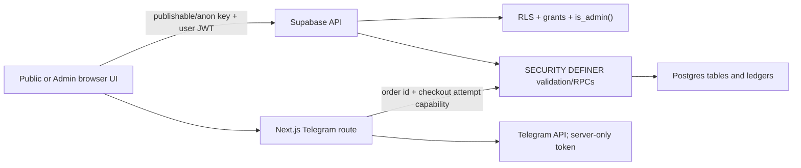
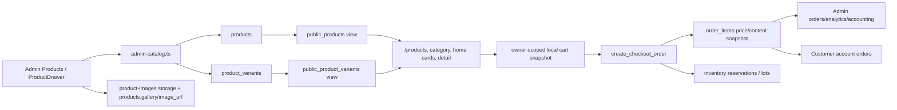
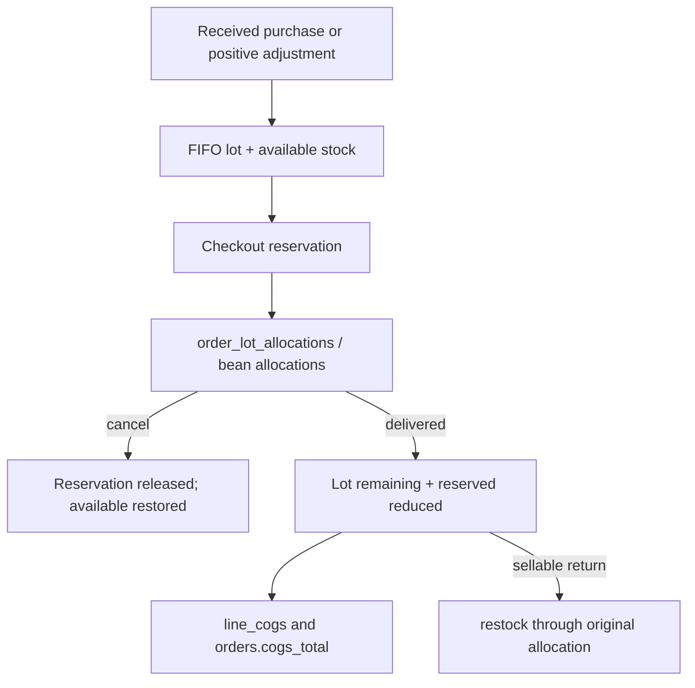
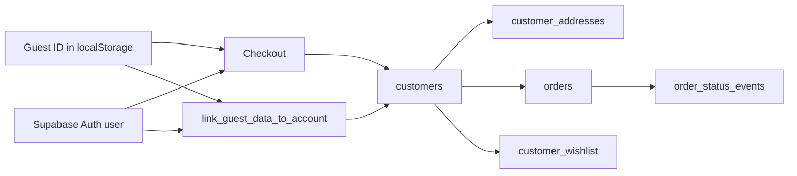

# Line Coffee V3 — Data Flow Map

Audit date: 2026-07-12  
Evidence basis: TypeScript clients/services plus SQL migrations. A live Supabase schema/policy dump was not queried, so “applied” state relies on repository/current-state documentation.

## Trust model

There is no service-role client in the repository. Public/admin browser writes rely on RLS or narrow SECURITY DEFINER functions. Prices, promo eligibility, stock and custom-builder calculations are re-read/recomputed in Postgres.

## Product lifecycle

| Stage | UI/service/function | Storage | Consumers / side effects | Owner edit path / risk |
|---|---|---|---|---|
| Create | `ProductCreateDrawer` → `createAdminProduct()` → `create_admin_product` (`admin-catalog.ts:1048-1109`; migration `20260627090000:64-133`) | products + variants | Becomes eligible for public view when lifecycle flags permit | Admin Products; slug/SKU uniqueness validated |
| Edit | `ProductDrawer` → direct RLS-gated updates and variant writes (`admin-catalog.ts:752-820`) | products, product_variants, inventory threshold | Public catalog reads new row; local carts keep snapshots until checkout | Checkout re-prices from DB, preventing client-price trust |
| Images | `admin-product-images.ts:182-287` | public `product-images` bucket; gallery/image_url fields | next/image cards/gallery/SEO image | Admin-only storage policies; deletion is immediate and can break cached/historical URLs |
| Archive/restore | `archiveAdminProduct` / `restoreAdminProduct` | product lifecycle fields | Public view membership changes | Historical order_items retain snapshots |
| Checkout | `CheckoutForm.tsx:506-628` → `create_checkout_order` | orders/order_items; customer/address/order snapshots | Reservations, promo redemption, packaging requirements | Server ignores browser price/total; validates item keys/stock |

## Category lifecycle

Admin Products → Categories uses `categories` direct admin-gated writes (`admin-catalog.ts:874-966,1117-1159`). A synchronization trigger/function maintains `products.category_slug` (`20260626160000_admin_categories_write.sql:61+`). `public_categories` feeds `/products`, category routes and SEO sitemap. Header/footer and homepage category shortcuts are partly static code lists, so a DB category rename/add/archive does not automatically update every navigation/editorial card.

## Order lifecycle

```mermaid
stateDiagram-v2
  [*] --> pending: create_checkout_order
  pending --> preparing
  pending --> cancelled: release reservation
  preparing --> shipped: reservation retained
  preparing --> cancelled: release reservation
  shipped --> delivered: deduct FIFO + calculate COGS
  shipped --> cancelled: transition only if SQL permits
  delivered --> returned: return ledger; eligible stock restock
```

| Step | Function/table | Exact behavior | Consumers / notes |
|---|---|---|---|
| Cart identity | `getOrCreateGuestId()` (`src/lib/checkout.ts:62-74`); cart owner key (`cart.tsx:165-190`) | Anonymous device UUID; registered cart keyed by auth user | Guest state is same-browser only |
| Submit | `CheckoutForm.tsx:506-628` | sends identity/address/payment/item keys/promo/attempt id, not authoritative price | In-flight guard + idempotent attempt id |
| Creation core | Current `create_checkout_order` wrapper (`20260704170000:145-197`) → `_create_checkout_order_phase67`; Phase 8/9 function body in `20260701120000` | replay existing receipt; enforce store open for new attempts; validate customer/address/items; re-read prices; resolve fee; reserve stock; insert snapshots | Returns order id/code/subtotal/discount/delivery/total |
| Product items | products/variants + order_items | Variant size → kg; unit/line totals snapshot; reserve finished-product FIFO | Prevents oversell |
| Espresso items | espresso tables; `20260701120000:1765-1791` | validate bean keys/ratios; recompute weighted sale price; reserve bean lots FIFO | Public studio is static but server truth is DB |
| Flavor items | flavor tables; `20260701120000:1520-1581` | validate base/1–4 flavor keys; price/kg = base + add-ons; cost snapshot; no stock | Cost enters delivered COGS |
| Promo | `_evaluate_promo_code`, `validate_promo_code`; wrapper lines `1298-1348` | enforce status/window/minimum/limits, compute/cap discount, create redemption | Delivery excluded |
| Packaging | Phase 6/7 helpers around `20260701104031:932-1170` | compute/deduct available packaging and record shortage/cost snapshot | Shortage is non-blocking |
| Telegram | POST `/api/order-notifications/telegram` (`route.ts:276-373`) | origin check; fetch trusted DB payload by order id + attempt capability; durable/warm dedupe; server-only token; 5s timeout | Failure never rolls back order |
| WhatsApp | order-success + `buildWhatsAppOrderHref()` | session receipt, auto-open once, manual resend | Operational handoff, not authoritative order storage |
| Admin status | `update_admin_order_status` called by `admin-orders.ts:541-600` | validates admin/transition; release on cancel; retain through shipped; deduct on delivered; status event | Public account notifications/timeline consume events |

### Customer account ownership

`account_customer_id(p_guest_id)` (migration `20260629130000`) resolves authenticated callers by `auth.uid()` and anonymous callers by validated guest ID. Account RPCs scope by resolved `customer_id`, not raw order IDs. `link_guest_data_to_account()` promotes same-device guest orders/addresses/wishlist after login/signup; it does not merge by phone/email.

## Inventory lifecycle

### Finished products

- Stock summary: `inventory_stock.available_kg`, `reserved_kg`, threshold.
- Lots: `inventory_lots.remaining_qty_kg`, `reserved_qty_kg`, unit cost; allocation: `order_lot_allocations`.
- Checkout allocates oldest eligible lots. Delivered status validates allocation completeness, deducts lots/stock, calculates per-line and total COGS (`20260630130000_phase5_fifo_reservations_cogs.sql:1190-1294`). Cancel releases reservations.
- Admin signed movements call `adjust_finished_product_stock` (`20260705133831:200-380`): positive creates adjustment lots; negative consumes only unreserved oldest quantity.

### Espresso beans

- Catalog/stock/lots/movements: `espresso_beans`, `espresso_bean_stock`, `espresso_bean_lots`, `espresso_bean_movements`; allocations: `order_espresso_bean_allocations`.
- Checkout reserves per blend ratio. Delivered deducts and computes bean COGS; cancel releases (`20260701120000:2109-2240`).

### Flavor and packaging

- Flavor is explicitly not stock-tracked. Checkout snapshots base/flavor cost and rolls it into COGS at delivered (`20260701120000:2250-2266`).
- Packaging is unit-count inventory in `packaging_items`/`packaging_movements`; it is deducted during order creation, not restored on cancellation/return under current logic. Shortages are logged but do not block order creation. Owner should decide whether that operational policy is acceptable.

## Accounting lifecycle and formulas

| Metric/workflow | Formula/source | Code |
|---|---|---|
| Product subtotal | sum order product/custom line totals snapshot | order/order_items creation SQL |
| Net product sales | product subtotal − discounts | `admin-accounting.ts:419,481` |
| Order total | subtotal − discount + delivery fee | `20260701104031:1309` |
| Delivered net sales | sales basis for delivered orders (net product sales plus configured delivery treatment in mapper) | `admin-accounting.ts:401-480` |
| COGS | stored `orders.cogs_total`, created at delivered from finished FIFO + bean FIFO + flavor cost snapshot + packaging cost handling | status RPCs/migrations; `admin-accounting.ts:448` |
| Gross profit | delivered net sales − COGS | `admin-accounting.ts:482` |
| Gross margin | gross profit / delivered net sales × 100 | `admin-accounting.ts:483` |
| Net collected | sum `order_payments.amount` − sum `order_refunds.amount` | `admin-accounting.ts:486-488` |
| Net profit | gross profit − operating expenses | `admin-accounting.ts:535` |
| Supplier payable | purchase total − supplier payments | purchases/supplier_payments mapping |

Purchase create (`create_purchase`) makes a draft and raises payable without changing inventory/P&L. Receive (`receive_purchase`) creates lots/movements and increases stock. Supplier payment reduces payable. Order payments/refunds are separate ledgers; delivered does not imply paid. Sellable return can affect stock, while refund affects cash only.

Risk: dashboard/accounting/analytics compute in the browser from capped row scans instead of database aggregates. At caps, values can be incomplete without a warning.

## Marketing lifecycle

### Promo

Admin Marketing → `upsert_promo_code`/`deactivate_promo_code` → `promo_codes` → checkout `validate_promo_code` for preview → `create_checkout_order` evaluates again with customer identity and locks usage → `promo_redemptions` → Analytics/Marketing counts.

Eligibility statuses include invalid, inactive, not started, expired, minimum not met, total usage limit, per-customer limit. Percentage/fixed discounts are capped by `max_discount` and subtotal (`20260701104031:648-752`).

### Announcement

Admin Marketing → `announcements` table → `listPublicAnnouncements()`/mapping in `src/lib/content/announcements.ts` → PublicHeader rotation. On failure/empty, code fallback is shown. Store-closed settings suppress/replace normal announcement behavior in the header/checkout.

## CMS/content lifecycle

| Admin source | Table/RPC | Public consumer | Wiring status |
|---|---|---|---|
| CMS Blog | `blog_posts`; `save_admin_blog_post` | `/blog`, `/blog/[slug]`, blog SEO/sitemap | Connected |
| CMS Reviews | `reviews`; `save_admin_review` | homepage approved/non-hidden testimonials | Connected |
| CMS Contact | `contact_messages`; `create_contact_message`, admin update RPC | Admin inbox only | Connected/private |
| CMS Legal | `legal_pages`; `save_admin_legal_page` | None; public legal routes use inline arrays | **Disconnected** |
| Settings | `site_settings` | header/footer/contact/checkout/home contact | Connected for public allowlisted keys |
| Homepage editorial | `visual-content.ts` | homepage | Code-controlled, no dashboard |

## Customer lifecycle

- Guest profile/orders/addresses/wishlist are same-device through `guest_id`; registered ownership is cross-device through auth user ID.
- Authenticated wishlist is server-only/memory; guest wishlist uses a guest-scoped localStorage cache (`useWishlist.ts:13-19,71-110`).
- Cart is local-only even for authenticated customers, although its key is owner-scoped.
- Notifications are projections of status events, with no read/unread table.
- Account Settings language is local-only and has no preference row.

## Owner change matrix

| Change | Correct source | Must remain synchronized with |
|---|---|---|
| Delivery zones/fees | SQL `resolve_delivery_fee()` | `src/lib/delivery.ts` display mirror; legal shipping copy |
| Product/variant price | Admin Products | No manual cart update needed; checkout re-prices |
| Builder bean/flavor catalog | Admin manager / Supabase | **Public static builder data currently must also be updated manually** |
| Legal policy | Public route code today | Admin CMS legal row is not consumed yet |
| Order lifecycle rules | status RPC/migration | Admin UI allowed-transition map and status labels |
| Accounting formula | SQL snapshots + admin mapper | Dashboard/Analytics terminology |

